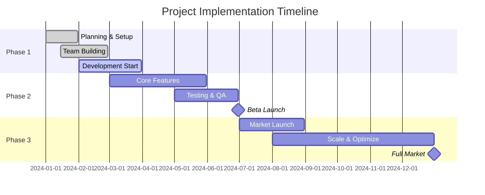

# Project/Initiative Title

**Presenter Name**  
_Title • Department_ <a href="https://company.com" class="ns-c-iconlink"><mdi-domain /></a>  

:: note ::

Board Meeting • Date • Confidential

---
layout: side-title
color: navy
align: rm-lm
titlewidth: is-4
---

:: title ::

# Executive Summary

:: content ::

## Key Points

- **Objective**: What we're proposing and why
- **Investment**: $XXX financial commitment required  
- **Timeline**: XX months to completion
- **ROI**: XX% return on investment expected
- **Risk Level**: Low/Medium/High with mitigation strategies

<Admonition title="Bottom Line" color="emerald-light">
**Recommendation**: Proceed with full funding for Q1 implementation
</Admonition>

---
layout: two-cols-title  
columns: is-6
align: l-lt-lt
color: slate-light
---

:: title ::

# Business Case

:: left ::

### Market Opportunity

- **Market Size**: $XX billion addressable market
- **Growth Rate**: XX% annual growth projected  
- **Competitive Position**: Our advantage vs. competitors
- **Customer Demand**: Validated need through research

### Strategic Alignment  

- **Company Vision**: Direct support of 2024 strategic goals
- **Revenue Goals**: Contributes $XXM to revenue targets
- **Market Position**: Strengthens competitive moat  
- **Innovation**: Demonstrates thought leadership

:: right ::

### Problem Statement

**Current State**: Describe existing challenges
- Pain point 1 costing $XX annually
- Pain point 2 limiting growth by XX%  
- Pain point 3 creating customer friction

**Impact**: Quantified business impact
- Lost revenue: $XXM annually
- Operational inefficiency: XX hours/week
- Customer satisfaction: XX% below target

<AdmonitionType type="important">
**Urgency**: Competitors launching similar solutions in Q2 2024
</AdmonitionType>

---
layout: top-title-two-cols
columns: is-6
align: l-lt-lt  
color: blue-light
---

:: title ::

# Solution Overview

:: left ::

### Proposed Solution  

**Core Approach**: High-level description of what we're building/implementing

**Key Features**:
- Feature 1 solving problem A
- Feature 2 addressing problem B  
- Feature 3 enabling opportunity C

**Differentiation**: What makes our approach unique and better than alternatives

### Implementation Strategy

**Phase 1** (Months 1-3): Foundation and core functionality
**Phase 2** (Months 4-6): Advanced features and optimization  
**Phase 3** (Months 7-9): Scale and market expansion

:: right ::

### Success Metrics

**Financial KPIs**:
- Revenue increase: $XXM by end of year
- Cost savings: $XXK monthly operational savings
- Customer acquisition: XX% increase in new customers

**Operational KPIs**:  
- Process efficiency: XX% time reduction
- Quality metrics: XX% improvement in satisfaction
- Market share: X% market share by end of 2024

<StickyNote color="blue-light" title="Key Milestone">
Break-even projected at month 8
</StickyNote>

---
layout: default
color: emerald-light
---

# Financial Analysis

## Investment Requirements

| Category | Year 1 | Year 2 | Year 3 | Total |
|----------|--------|--------|--------|-------|
| **Personnel** | $XXXk | $XXXk | $XXXk | $XXXk |
| **Technology** | $XXXk | $XXXk | $XXXk | $XXXk |
| **Marketing** | $XXXk | $XXXk | $XXXk | $XXXk |
| **Operations** | $XXXk | $XXXk | $XXXk | $XXXk |
| **Total Investment** | **$XXXk** | **$XXXk** | **$XXXk** | **$XXXk** |

## Expected Returns

<AdmonitionType type="tip">
**ROI Analysis**: 245% return over 3 years
</AdmonitionType>

<StickyNote color="green-light">
**Payback Period**: 18 months break-even point
</StickyNote>

---
layout: image-right
image: /path/to/financial-chart.png
---

# Revenue Projections

## Three-Year Financial Forecast

**Key Assumptions**:
- Market growth rate: XX% annually
- Customer acquisition rate: XX new customers/month
- Average contract value: $XX,XXX
- Churn rate: X% monthly

**Conservative Scenario**: $XXM revenue by Year 3
**Optimistic Scenario**: $XXM revenue by Year 3

<AdmonitionType type="note">
Projections based on market research and competitive analysis
</AdmonitionType>

---
layout: two-cols-title
columns: is-6
color: amber-light
---

:: title ::

# Risk Assessment & Mitigation

:: left ::

### High-Priority Risks

**Market Risk** (Medium)
- **Risk**: Competitive response or market shift
- **Mitigation**: Accelerated timeline, patent protection
- **Contingency**: Pivot strategy prepared

**Technical Risk** (Low)  
- **Risk**: Implementation complexity or delays
- **Mitigation**: Experienced team, proven technology stack
- **Contingency**: Vendor partnerships as backup

**Financial Risk** (Low)
- **Risk**: Budget overruns or revenue shortfall
- **Mitigation**: Phased funding, milestone-based releases  
- **Contingency**: Scope reduction plan prepared

:: right ::

### Risk Monitoring

**Weekly Reviews**: Technical progress and budget tracking
**Monthly Reviews**: Market conditions and competitive landscape
**Quarterly Reviews**: Financial performance and strategic alignment

### Success Factors

- **Executive Sponsorship**: Clear leadership support and decision authority
- **Resource Allocation**: Dedicated team with necessary skills and budget
- **Market Timing**: Launch window alignment with market readiness
- **Customer Engagement**: Early customer feedback and iteration capability

---
layout: default
color: violet-light
---

# Implementation Timeline

## Project Roadmap

<SpeechBubble position="r" color="amber-light">
**Critical Path**: Development completion by end of Q2 for summer launch window
</SpeechBubble>

---
layout: two-cols-title
columns: is-6
color: sky-light
---

:: title ::

# Team & Resources

:: left ::

### Organizational Structure

**Project Sponsor**: Executive Name (decision authority)
**Project Manager**: Manager Name (day-to-day execution)  
**Technical Lead**: Developer Name (technical oversight)

### Required Resources

**Full-time Team** (6 people):
- 2 Senior Developers  
- 1 UX/UI Designer
- 1 Product Manager
- 1 QA Engineer  
- 1 Marketing Specialist

**Part-time Support**:
- Legal counsel (IP and contracts)
- Finance team (budget tracking)
- Sales team (customer development)

:: right ::

### External Partnerships

**Technology Partners**:
- Cloud infrastructure provider
- Security compliance consultants
- Development tools and platforms

**Business Partners**:
- Market research firm
- PR and communications agency  
- Strategic customer partners

### Budget Allocation

- **70% Personnel**: Largest investment in team
- **20% Technology**: Infrastructure and tools
- **10% Marketing**: Launch and awareness

---
layout: section
color: emerald
---

# Competitive Analysis

Understanding our position in the market landscape

---
layout: two-cols-title
columns: is-6
align: l-lt-lt
color: light
---

:: title ::

# Competitive Landscape

:: left ::

### Direct Competitors

**Competitor A**  
- Strengths: Market leader, enterprise sales  
- Weaknesses: Legacy technology, slow innovation
- Market share: 35%

**Competitor B**
- Strengths: Low cost, simple implementation
- Weaknesses: Limited features, poor support  
- Market share: 20%

**Competitor C**
- Strengths: Technical innovation, developer-friendly
- Weaknesses: Small company, funding concerns
- Market share: 15%

:: right ::

### Our Competitive Advantage  

**Unique Value Proposition**:
- Combination of enterprise-grade reliability with modern UX
- Proprietary technology providing 10x performance improvement  
- Strategic partnerships enabling rapid market penetration

**Competitive Moat**:
- Patent applications filed for core technology
- Network effects increase value with adoption
- High switching costs once integrated

<AdmonitionType type="important">
**Market Window**: 18-month advantage before competitors catch up
</AdmonitionType>

---
layout: quote
color: navy
author: "Customer Name, Senior VP at Fortune 500 Company"  
quotesize: text-lg
authorsize: text-sm
---

"This solution addresses our biggest operational challenge and could save us millions annually. We're ready to be a launch partner and reference customer."

---
layout: default
color: pink-light
---

# Next Steps & Decision Points

## Immediate Actions Required

1. **Funding Approval**: $XXXk budget authorization for Phase 1  
2. **Team Assembly**: Begin recruiting key personnel within 2 weeks
3. **Legal Review**: IP strategy and competitive protection analysis
4. **Customer Validation**: Finalize launch partner agreements

## Decision Timeline

**Today**: Board approval for project initiation
**Next Week**: Team lead hiring and onboarding begins  
**Month End**: Phase 1 planning complete and development starts
**Q2 End**: MVP ready for beta customer testing

<AdmonitionType type="important">
**Critical Decision**: Must approve funding by [DATE] to meet market window
</AdmonitionType>

<StickyNote color="amber-light">
**Resource Commitment**: 6 FTE + $XXXk budget for 12 months
</StickyNote>

---
layout: credits
color: navy 
speed: 2.0
---

  
  **Thank You**

  <strong>Project Contributors</strong>

<strong>Executive Team</strong>

Project Sponsor Department Head Finance Director

<strong>Analysis Team</strong>

Market Research Team Financial Analysis Team Technical Assessment Team

<strong>Customer Input</strong>

Beta Customer Interviews Market Advisory Board Customer Success Team

<strong>External Partners</strong>

Market Research Firm Technology Consultants Legal Advisors

<strong>Questions & Discussion</strong>

---
layout: end  
---

# Thank You

**Questions & Discussion**

**Follow-up**  
📧 presenter-email@company.com  
📊 **Full Analysis**: [Internal Link to Detailed Report]  
📅 **Next Meeting**: [Date] for implementation planning