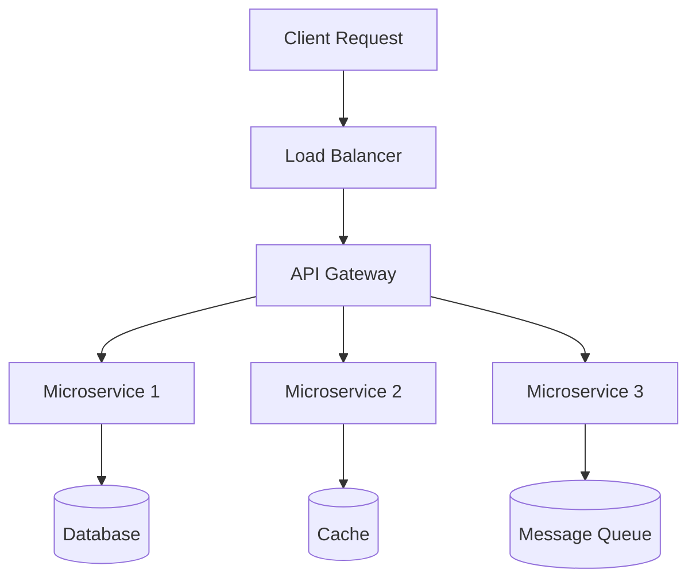

# Technical Project Title

**Your Name**  
_Company/Team_ <a href="https://github.com/yourhandle" class="ns-c-iconlink"><mdi-github /></a>  

:: note ::

Tech Talk • Conference • Date

---
layout: side-title
color: dark
align: rm-lm
titlewidth: is-3
---

:: title ::

# Problem

:: content ::

## What We're Solving

<div class="ns-c-tight">

- **User Pain Point**: Specific problem users face daily
- **Technical Challenge**: The underlying technical complexity  
- **Scale Issues**: Performance, reliability, or maintainability concerns
- **Business Impact**: Cost/time/efficiency implications

</div>

<SpeechBubble position="r" color="amber-light">
Why existing solutions don't work well enough
</SpeechBubble>

---
layout: two-cols-title
columns: is-6
align: l-lt-lt
color: slate-light
---

:: title ::

# Current Solution vs. Our Approach

:: left ::

### Existing Approaches

```python
# Traditional way
def old_solution(data):
    # Inefficient processing
    results = []
    for item in data:
        processed = expensive_operation(item)
        results.append(processed)
    return results
```

**Problems:**
- ❌ Slow processing (O(n²))
- ❌ Memory intensive  
- ❌ No error handling
- ❌ Hard to scale

:: right ::

### Our Solution

```python
# Optimized approach
async def new_solution(data):
    # Efficient batch processing
    async with ProcessPool() as pool:
        tasks = [pool.apply_async(
            optimized_operation, item
        ) for item in data]
        return await gather(*tasks)
```

**Benefits:**
- ✅ Fast processing (O(n))
- ✅ Memory efficient
- ✅ Robust error handling  
- ✅ Horizontally scalable

---
layout: top-title
color: navy
align: l
---

:: title ::

# Architecture Overview

:: content ::



<StickyNote color="cyan-light" textAlign="left" width="200px">
**Key Design**: Event-driven microservices with async processing
</StickyNote>

---
layout: default
color: emerald-light
---

# Implementation Deep Dive

## Core Algorithm

```typescript
interface ProcessorConfig {
  batchSize: number;
  timeout: number;
  retryLimit: number;
}

class BatchProcessor<T> {
  private queue: T[] = [];
  
  async process(items: T[], config: ProcessorConfig): Promise<Result<T>[]> {
    const batches = this.createBatches(items, config.batchSize);
    
    return Promise.allSettled(
      batches.map(batch => 
        this.processBatch(batch, config)
      )
    );
  }
  
  private async processBatch(batch: T[], config: ProcessorConfig) {
    // Implementation with timeout and retry logic
  }
}
```

<AdmonitionType type="tip">
Generic implementation allows reuse across different data types
</AdmonitionType>

---
layout: two-cols-title
columns: is-6
color: sky-light
---

:: title ::

# Performance Results

:: left ::

## Benchmark Comparison

| Metric | Old System | New System | Improvement |
|--------|------------|------------|-------------|
| **Throughput** | 100 req/s | 2,500 req/s | 25x |
| **Latency (p99)** | 2.5s | 45ms | 55x |
| **Memory** | 2GB | 512MB | 4x |
| **CPU** | 80% | 15% | 5.3x |

<AdmonitionType type="important">
**Real-world impact**: 99.7% latency reduction in production
</AdmonitionType>

:: right ::

## Load Testing Results

```python
# Load test configuration
@pytest.mark.performance
async def test_high_load():
    concurrent_users = 1000
    requests_per_user = 100
    
    async with aiohttp.ClientSession() as session:
        tasks = []
        for user in range(concurrent_users):
            tasks.append(simulate_user_load(
                session, requests_per_user
            ))
        
        results = await asyncio.gather(*tasks)
        assert all(r.success_rate > 0.99 for r in results)
```

<StickyNote color="green-light">
**Success Rate**: 99.9% even under extreme load
</StickyNote>

---
layout: image-right
image: /path/to/monitoring-dashboard.png
---

# Monitoring & Observability

## Key Metrics We Track

<div class="ns-c-tight">

- **Application Performance**: Response times, error rates
- **Infrastructure**: CPU, memory, disk, network utilization  
- **Business Metrics**: User engagement, conversion rates
- **Security**: Authentication failures, suspicious patterns

</div>

## Alerting Strategy

<div class="ns-c-tight">

- **P0 Alerts**: System down, data loss, security breach
- **P1 Alerts**: Performance degradation, high error rates
- **P2 Alerts**: Capacity warnings, maintenance reminders

</div>

<AdmonitionType type="note">
Dashboard shows real-time metrics and historical trends
</AdmonitionType>

---
layout: full
---

# Live Demo

<div class="h-full w-full p-8">

<div class="text-center mb-8">

## Interactive Code Example

</div>

<SpeechBubble position="l" color="amber" v-drag="[50,200,300,80]">
Let me show you how this actually works in practice
</SpeechBubble>

<div class="bg-gray-800 text-green-400 p-6 rounded-lg font-mono text-sm" v-drag="[400,150,400,300]">

```bash  
$ npm run demo
Starting development server...
✅ Server running on http://localhost:3000

$ curl -X POST http://localhost:3000/api/process \
  -H "Content-Type: application/json" \
  -d '{"data": ["item1", "item2", "item3"]}'

{
  "processed": 3,
  "time_ms": 45,
  "success": true
}
```

</div>

<StickyNote color="cyan-light" v-drag="[100,450,250,100]">
**Try it yourself**: github.com/yourrepo/demo
</StickyNote>

</div>

---
layout: two-cols-title
columns: is-6
color: violet-light
---

:: title ::

# Lessons Learned & Next Steps

:: left ::

### What Worked Well

<div class="ns-c-tight">

- **Async Architecture**: Event-driven design scales beautifully
- **Type Safety**: TypeScript prevented many runtime errors
- **Testing Strategy**: TDD approach caught issues early
- **Monitoring**: Observability was crucial for optimization

</div>

### Challenges Faced

<div class="ns-c-tight">

- **Complexity**: Distributed systems are inherently complex
- **Debugging**: Async code harder to trace and debug  
- **Team Learning**: New patterns required team training
- **Migration**: Gradual rollout needed careful planning

</div>

:: right ::

### Future Roadmap

<div class="ns-c-tight">

- **Q1 2024**: Machine learning integration for smart routing
- **Q2 2024**: Multi-region deployment for global scale
- **Q3 2024**: GraphQL API layer for better developer experience
- **Q4 2024**: Open source core components

</div>

### Open Questions

<div class="ns-c-tight">

- **Cost Optimization**: Further efficiency improvements possible?
- **AI Integration**: Where can ML add the most value?
- **Community**: How to build ecosystem around our tools?

</div>

---
layout: default
color: emerald
---

# Key Takeaways

## Technical Principles

<div class="ns-c-tight">

1. **Measure First**: Profile before optimizing - assumptions are often wrong
2. **Async by Default**: Modern apps need async patterns for scale
3. **Type Safety**: Strong typing prevents entire categories of bugs
4. **Observability**: You can't improve what you can't measure
5. **Gradual Rollout**: Feature flags and gradual deployment reduce risk

</div>

<SpeechBubble position="r" color="amber-light">
**Remember**: Premature optimization is the root of all evil, but **late** optimization is the root of all performance problems!
</SpeechBubble>

---
layout: credits
color: dark
speed: 2.5
---

<div class="grid text-size-4 grid-cols-3 w-3/4 gap-y-10 auto-rows-min ml-auto mr-auto">
<div class="grid-item text-center col-span-3">
  
  **Thank You**
</div>
<div class="grid-item text-center col-span-3">
  <strong>Team & Contributors</strong>
</div>

<div class="grid-item text-right mr-4 col-span-1"><strong>Core Team</strong></div>
<div class="grid-item col-span-2">Frontend Developer<br/>Backend Developer<br/>DevOps Engineer</div>

<div class="grid-item text-right mr-4 col-span-1"><strong>Special Thanks</strong></div>
<div class="grid-item col-span-2">Beta Testers<br/>Community Contributors<br/>Code Reviewers</div>

<div class="grid-item text-right mr-4 col-span-1"><strong>Technologies</strong></div>
<div class="grid-item col-span-2">TypeScript<br/>Node.js<br/>Docker<br/>Kubernetes<br/>PostgreSQL</div>

<div class="grid-item text-right mr-4 col-span-1"><strong>Resources</strong></div>
<div class="grid-item col-span-2">📦 NPM: @yourorg/package<br/>📚 Docs: docs.yourproject.com<br/>🔗 GitHub: github.com/yourorg/project</div>

<div class="grid-item col-span-3 text-center mt-40 font-size-5"><strong>Questions?</strong><br/>Let's discuss the technical details!</div>
</div>

---
layout: end
---

# Let's Build Together

**Resources**  
📦 **Package**: `npm install @yourorg/package`  
📚 **Documentation**: docs.yourproject.com  
🐙 **Source Code**: github.com/yourorg/project  
💬 **Discussion**: GitHub Discussions or Discord  

**Contact**  
📧 your-email@company.com  
🐦 @yourhandle