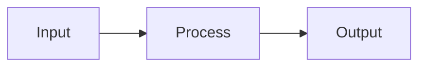

# Introduction to [Your Topic]
**A Comprehensive Guide**

**Your Name**  
<your.email@example.com>

:: note ::
Last updated: 2026-02-09

<!--
TECH-SLIDE TEMPLATE
Complete example following tech-slide patterns

COLOR SCHEME: Navy (Primary) + Light Mode
- Full-color slides: Cover, Sections, Key Takeaways (navy/navy-light)
- Content slides: White background (no color)
- Accents: Navy for highlights and callouts

DESIGN PRINCIPLES:
- Keep slides simple and minimal
- Avoid excessive emojis (use sparingly, only when adding value)
- No emojis in section titles - keep headers professional
- Focus on content over decoration
-->

<style>
/* Global styles - placed after first slide but applies to all slides */
.slidev-layout h1 + p,
.slidev-layout h1 + ul,
.slidev-layout h1 + ol,
.slidev-layout h1 + pre,
.slidev-layout h1 + blockquote,
.slidev-layout h1 + table,
.slidev-layout h1 + div,
.slidev-layout h1 + .v-clicks,
.slidev-layout h1 + .v-click {
  margin-top: 1.5rem !important;
}
</style>

---
layout: side-title
side: l
align: lm-lm
colorSchema: light
color: navy
# NO COLOR - white background for ToC
---

:: title ::
# Table of Contents

:: content ::

<div style="font-weight: bold">

1. Background & Motivation
2. Core Concepts
3. Implementation Guide
4. Best Practices
5. Key Takeaways

</div>

---
layout: section
color: navy
---

# Section: Background & Motivation
<hr>

<div>

<div style="font-weight: bold">1. Background & Motivation</div>
<div style="opacity: 0.4">2. Core Concepts</div>
<div style="opacity: 0.4">3. Implementation Guide</div>
<div style="opacity: 0.4">4. Best Practices</div>
<div style="opacity: 0.4">5. Key Takeaways</div>

</div>

---
layout: default
---

# Why This Topic Matters

- **Problem Statement**: What problem does this solve?
- **Current Challenges**: What pain points exist?
- **Our Solution**: How does this topic address them?

<!-- <v-click> -->

> **Hello**  
> A relevant quote or insight about the topic  

<!-- </v-click> -->

---
layout: two-cols-title
# NO COLOR - white background for content
---

:: title ::
# Historical Context

:: left ::

### Before
- Old approach
- Limitations
- Pain points

:: right ::

### After
- Modern solution
- Benefits
- Improvements

---
layout: section
color: navy
---

# Section: Core Concepts
<hr>

<div>

<div style="opacity: 0.4">1. Background & Motivation</div>
<div style="font-weight: bold">2. Core Concepts</div>
<div style="opacity: 0.4">3. Implementation Guide</div>
<div style="opacity: 0.4">4. Best Practices</div>
<div style="opacity: 0.4">5. Key Takeaways</div>

</div>

---
layout: default
---

# Fundamental Principle #1

**Definition**: Clear explanation of the concept

```python
# Code example demonstrating the concept
def example_function():
    """Docstring explaining what this does"""
    return "result"
```

<v-clicks>

- **Key Point**: Important detail
- **Implication**: What this means
- **Usage**: When to apply this

</v-clicks>

---
layout: two-cols-title
---

:: title ::
# Fundamental Principle #2

:: left ::

### Concept Overview
- Point 1
- Point 2
- Point 3

:: right ::

### Visual Diagram


---
layout: section
color: navy
---

# Section: Implementation Guide
<hr>

<div>

<div style="opacity: 0.4">1. Background & Motivation</div>
<div style="opacity: 0.4">2. Core Concepts</div>
<div style="font-weight: bold">3. Implementation Guide</div>
<div style="opacity: 0.4">4. Best Practices</div>
<div style="opacity: 0.4">5. Key Takeaways</div>

</div>

---
layout: default
---

# Step 1: Environment Setup

Set up your development environment with the required tools and packages.

```bash
# Installation commands
npm install package-name

# Or using other package managers
pip install package-name
```

<v-click>

**Requirements:**
- Requirement 1
- Requirement 2
- Requirement 3

</v-click>

---
layout: two-cols-title
---

:: title ::
# Step 2: Basic Implementation

:: left ::

```python
# Example code
class Example:
    def __init__(self):
        self.data = []
    
    def process(self, item):
        self.data.append(item)
```

:: right ::

**Explanation:**
1. Define the class
2. Initialize data structure
3. Implement processing logic

<v-click>

💡 **Tip**: Best practice note here

</v-click>

---
layout: default
---

# Step 3: Advanced Usage

Progressively enhance your implementation with advanced features.

````md magic-move
```python
# Basic version
def process_data(data):
    return data
```

```python
# Enhanced version
def process_data(data):
    validated = validate(data)
    return transform(validated)
```

```python
# Production version
def process_data(data):
    validated = validate(data)
    transformed = transform(validated)
    cached = cache.set(transformed)
    return cached
```
````

---
layout: section
color: navy
---

# Section: Best Practices
<hr>

<div>

<div style="opacity: 0.4">1. Background & Motivation</div>
<div style="opacity: 0.4">2. Core Concepts</div>
<div style="opacity: 0.4">3. Implementation Guide</div>
<div style="font-weight: bold">4. Best Practices</div>
<div style="opacity: 0.4">5. Key Takeaways</div>

</div>

---
layout: two-cols-title
---

:: title ::
# Do's and Don'ts

:: left ::

### ✅ Do
- Follow this pattern
- Use this approach
- Consider this method

:: right ::

### ❌ Don't
- Avoid this anti-pattern
- Don't use this way
- Skip this approach

---
layout: default
---

# Performance Considerations

Optimize your implementation for better performance and scalability.

<v-clicks>

1. **Optimization 1**: How to improve performance
2. **Optimization 2**: Memory management tips
3. **Optimization 3**: Scalability patterns

</v-clicks>

<v-click>

```python
# Example of optimized code
@cache
def expensive_operation(data):
    return process(data)
```

</v-click>

---
layout: default
---

# Common Pitfalls

Avoid these common mistakes when implementing your solution.

| Issue | Cause | Solution |
|-------|-------|----------|
| Problem 1 | Root cause | How to fix |
| Problem 2 | Root cause | How to fix |
| Problem 3 | Root cause | How to fix |

---
layout: default
---

# Key Takeaways

Main learnings from this presentation:

- **Concept A**: Core understanding gained from this topic
- **Concept B**: Key skill or technique learned
- **Concept C**: Important principle or best practice
- **Next Steps**: Continue learning with documentation and practice projects
- **Resources**: Join the community and explore additional materials

---
layout: section
color: navy
---

<div style="text-align: center">

# Thank You!

<!-- Optional: Add QR Code for survey/feedback
<div style="margin-top: 3rem; display: flex; flex-direction: column; align-items: center">

<QRCode value="https://your-survey-link.com" :size="200" render-as="svg" />

<div style="margin-top: 1rem">

**Scan for feedback survey**

</div>

</div> -->

</div>
