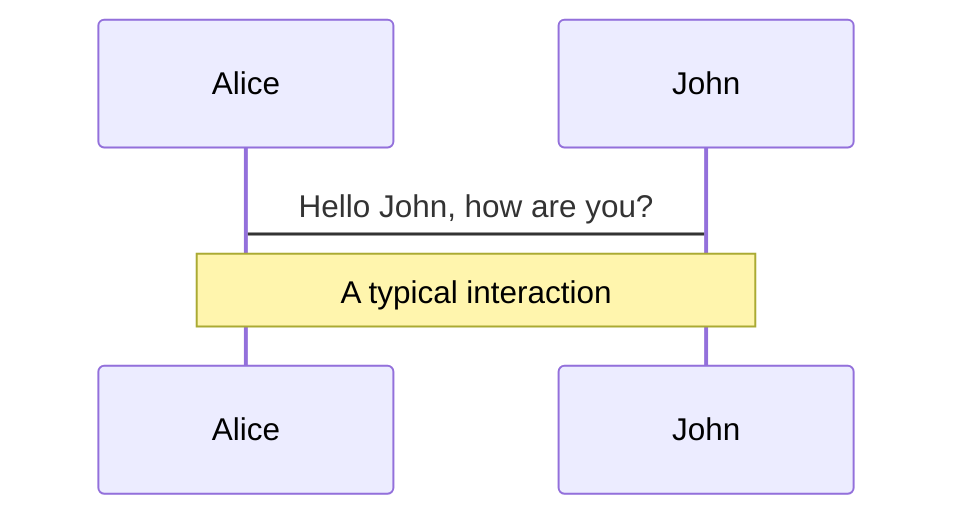
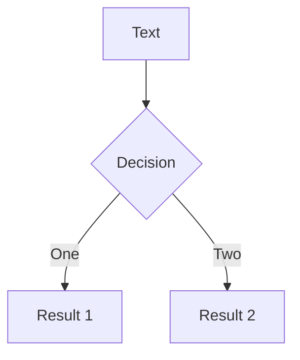
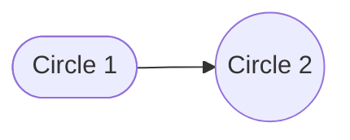

================================================
FILE: README.md
================================================
# Slidev Theme Neversink

An education/academia oriented Slidev theme with some whimsical elements.

Example [slides](https://gureckis.github.io/slidev-theme-neversink/example/).
Documentation [here](https://gureckis.github.io/slidev-theme-neversink/)
Read about [Slidev](https://sli.dev/).

## Installation

```bash
npm install slidev-theme-neversink
```

## Usage

Add the theme to the frontmatter of your first slide in `slides.md`:

```md
---
theme: neversink
---
```

## Features

- [Color schemes](https://gureckis.github.io/slidev-theme-neversink/colors) - the color schemes available in Neversink
- [Custom layouts](https://gureckis.github.io/slidev-theme-neversink/layouts) - the custom slide layouts available in Neversink
- [Branding](https://gureckis.github.io/slidev-theme-neversink/branding) - how to customize the theme to your brand/logos
- [Components](https://gureckis.github.io/slidev-theme-neversink/components) - the custom components such as sticky notes and admonitions
- [Markdown features](https://gureckis.github.io/slidev-theme-neversink/markdown) - special addons to the Slidev markdown syntax

## Examples

- Example [slides](https://gureckis.github.io/slidev-theme-neversink/example/).


================================================
FILE: example.md
================================================
---
colorSchema: auto
layout: cover
routerMode: hash
title: Base Template
theme: ./
neversink_string: "Neversink Example Deck"
---

# Neversink

A [Slidev](https://sli.dev) theme designed by **Todd Gureckis**   
_New York University_ <a href="https://todd.gureckislab.org" class="ns-c-iconlink"><mdi-open-in-new /></a>  


---
layout: side-title
color: amber
align : rm-lm
---

:: title ::

# Slidev Neversink Theme

:: content ::

Neversink is theme for education and academic presentations.  It is designed to be bright, flat, minimal, and easy to read.  It is based on the default Slidev theme but with some additional features and color schemes that have reference in the [metropolis](https://github.com/matze/mtheme) Beamer theme among others.

It is named for the [Neversink River](https://en.wikipedia.org/wiki/Neversink_River) for absolutely no discernable reason.

---
layout: default
---

# Why use it?


- Neversink has several configurable ==layouts== that build upon the Slidev defaults and which make it easier to quickly throw together common slide layouts without having to write a lot of custom CSS/HTML.

- It has a variety of ==color themes== to choose from that make your visual identity more coherent. 


- It also has some whimsical elements like movie-style scrolling credits, animated speech bubbles, and admonitions that make your presentations more memorable.

- It strives to be well documented and easy to use! 


 You can find the source code on [GitHub](http://github.com/gureckis/slidev-theme-neversink).

---
layout: default
---

# How to install


The theme depends on Slidev.  So you need to have that [installed first](https://sli.dev/guide/install).  Then you can install the theme with npm:

```bash
npm install slidev-theme-neversink
```

Then create a slidev markdown file (e.g., `slides.md`) and add the theme to the frontmatter of your first slide:

```md
---
theme: neversink
---
```

Then you are basically ready to go!


---
layout: default
---

# Color schemes


Let's start with colors.  

The project uses tailwind-like color schemes arranged in ==monochromatic pairs==. These boxes show the options and names:

**B&W**:

<div class="leading-[1.5em]">
<span class="text-white bg-black p-1 pl-3 pr-3 m-1 rounded font-size-3">black</span>
<span class="text-black bg-white border-1 border-solid border-black p-1 pl-3 pr-3 m-1 rounded font-size-3">white</span>
<span class="text-gray-100 bg-gray-800 p-1 pl-3 pr-3 m-1 rounded font-size-3">dark</span>
<span class="text-gray-800 bg-gray-100 p-1 pl-3 pr-3 m-1 rounded font-size-3">light</span>

</div>

**Light**:

<div class="leading-[1.5em]">
<span class="bg-slate-100 text-slate-500 p-1 pl-3 pr-3 m-1 rounded font-size-3">slate-light</span>
<span class="bg-gray-100 text-gray-500 p-1 pl-3 pr-3 m-1 rounded font-size-3">gray-light</span>
<span class="bg-zinc-100 text-zinc-500 p-1 pl-3 pr-3 m-1 rounded font-size-3">zinc-light</span>
<span class="bg-neutral-100 text-neutral-500 p-1 pl-3 pr-3 m-1 rounded font-size-3">neutral-light</span>
<span class="bg-stone-100 text-stone-500 p-1 pl-3 pr-3 m-1 rounded font-size-3">stone-light</span>
<span class="bg-red-100 text-red-500 p-1 pl-3 pr-3 m-1 rounded font-size-3">red-light</span>
<span class="bg-orange-100 text-orange-500 p-1 pl-3 pr-3 m-1 rounded font-size-3">orange-light</span>
<span class="bg-amber-100 text-amber-500 p-1 pl-3 pr-3 m-1 rounded font-size-3">amber-light</span>
<span class="bg-yellow-100 text-yellow-500 p-1 pl-3 pr-3 m-1 rounded font-size-3">yellow-light</span><br />
<span class="bg-lime-100 text-lime-500 p-1 pl-3 pr-3 m-1 rounded font-size-3">lime-light</span>
<span class="bg-green-100 text-green-500 p-1 pl-3 pr-3 m-1 rounded font-size-3">green-light</span>
<span class="bg-emerald-100 text-emerald-500 p-1 pl-3 pr-3 m-1 rounded font-size-3">emerald-light</span>
<span class="bg-teal-100 text-teal-500 p-1 pl-3 pr-3 m-1 rounded font-size-3">teal-light</span>
<span class="bg-cyan-100 text-cyan-500 p-1 pl-3 pr-3 m-1 rounded font-size-3">cyan-light</span>
<span class="bg-sky-100 text-sky-500 p-1 pl-3 pr-3 m-1 rounded font-size-3">sky-light</span>
<span class="bg-blue-100 text-blue-500 p-1 pl-3 pr-3 m-1 rounded font-size-3">blue-light</span>
<span class="bg-indigo-100 text-indigo-500 p-1 pl-3 pr-3 m-1 rounded font-size-3">indigo-light</span>
<span class="bg-violet-100 text-violet-500 p-1 pl-3 pr-3 m-1 rounded font-size-3">violet-light</span><br />
<span class="bg-purple-100 text-purple-500 p-1 pl-3 pr-3 m-1 rounded font-size-3">purple-light</span>
<span class="bg-pink-100 text-pink-500 p-1 pl-3 pr-3 m-1 rounded font-size-3">pink-light</span>
<span class="bg-rose-100 text-rose-500 p-1 pl-3 pr-3 m-1 rounded font-size-3">rose-light</span>
<span class="bg-fuchsia-100 text-fuchsia-500 p-1 pl-3 pr-3 m-1 rounded font-size-3">fuchsia-light</span>
<span class="bg-gray-50 text-navy-900 p-1 pl-3 pr-3 m-1 rounded font-size-3">navy-light</span>
</div>

**Regular**:

<div class="leading-[1.5em]">
<span class="bg-slate-500 text-slate-100 p-1 pl-3 pr-3 m-1 rounded font-size-3">slate</span>
<span class="bg-gray-500 text-gray-100 p-1 pl-3 pr-3 m-1 rounded font-size-3">gray</span>
<span class="bg-zinc-500 text-zinc-100 p-1 pl-3 pr-3 m-1 rounded font-size-3">zinc</span>
<span class="bg-neutral-500 text-neutral-100 p-1 pl-3 pr-3 m-1 rounded font-size-3">neutral</span>
<span class="bg-stone-500 text-stone-100 p-1 pl-3 pr-3 m-1 rounded font-size-3">stone</span>
<span class="bg-red-500 text-red-100 p-1 pl-3 pr-3 m-1 rounded font-size-3">red</span>
<span class="bg-orange-500 text-orange-100 p-1 pl-3 pr-3 m-1 rounded  font-size-3">orange</span>
<span class="bg-amber-500 text-amber-100 p-1 pl-3 pr-3 m-1 rounded font-size-3">amber</span>
<span class="bg-yellow-500 text-yellow-100 p-1 pl-3 pr-3 m-1 rounded font-size-3">yellow</span>
<span class="bg-lime-500 text-lime-100 p-1 pl-3 pr-3 m-1 rounded font-size-3">lime</span>
<span class="bg-green-500 text-green-100 p-1 pl-3 pr-3 m-1 rounded font-size-3">green</span>
<span class="bg-emerald-500 text-emerald-100 p-1 pl-3 pr-3 m-1 rounded font-size-3">emerald</span>
<span class="bg-teal-500 text-teal-100 p-1 pl-3 pr-3 m-1 rounded font-size-3">teal</span>
<span class="bg-cyan-500 text-cyan-100 p-1 pl-3 pr-3 m-1 rounded font-size-3">cyan</span><br/>
<span class="text-gray-300 bg-navy-900 p-1 pl-3 pr-3 m-1 rounded font-size-3">navy</span>
<span class="bg-sky-500 text-sky-100 p-1 pl-3 pr-3 m-1 rounded font-size-3">sky</span>
<span class="bg-blue-500 text-blue-100 p-1 pl-3 pr-3 m-1 rounded font-size-3">blue</span>
<span class="bg-indigo-500 text-indigo-100 p-1 pl-3 pr-3 m-1 rounded font-size-3">indigo</span>
<span class="bg-violet-500 text-violet-100 p-1 pl-3 pr-3 m-1 rounded font-size-3">violet</span>
<span class="bg-purple-500 text-purple-100 p-1 pl-3 pr-3 m-1 rounded font-size-3">purple</span>
<span class="bg-pink-500 text-pink-100 p-1 pl-3 pr-3 m-1 rounded font-size-3">pink</span>
<span class="bg-rose-500 text-rose-100 p-1 pl-3 pr-3 m-1 rounded font-size-3">rose</span>
<span class="bg-fuchsia-500 text-fuchsia-100 p-1 pl-3 pr-3 m-1 rounded font-size-3">fuchsia</span>
</div>

---
layout: default
---

# Color schemes

In many parts of the theme you can use the color schemes to help choose matching colors for your slides.  For example, we can make a slide with a sticky note using the `rose-light` color scheme, the `sky` color scheme, or the `amber-light` color scheme:

<StickyNote color="rose-light" textAlign="left" width="180px" v-drag="[122,253,180,180,-14]">

Hello, I'm a **redish sticky note** using `rose-light`.
</StickyNote>

<StickyNote color="sky" textAlign="left" width="180px"  v-drag="[389,251,180,180,9]">

Hello, I'm a **blueish sticky note** using `sky`.
</StickyNote>


<StickyNote color="amber-light" textAlign="left" width="180px"  v-drag="[650,253,180,180,-9]">

Hello, I'm a **yellowish sticky note** using `amber-light`.
</StickyNote>


---
layout: side-title
color: emerald-light
align: rm-lm
titlewidth: is-3
---

<StickyNote color="emerald-light" textAlign="left" width="180px"  v-drag="[719,291,180,180,16]">

Don't worry if you don't understand all the details, yet we are still talking about **color schemes**.
</StickyNote>


:: title ::
# Color schemes


:: content ::

Or we can use the `emerald-light` scheme in a slide layout to set the overall color and style of a slide with a matching sticky note:

```md
---
layout: side-title
color: emerald-light
align: rm-lm
titlewidth: is-3
---
```

---
layout: top-title
color: amber
align: l
---

:: title ::
# Layouts

:: content ::

The theme includes many layouts. Layouts set the overall structure of the page.  For example, this slide is using the `top-title` layout with the `amber` color scheme.  You can see the frontmatter for this slide below:

```md
---
layout: top-title
color: amber
align: l
---
```

The previous slide used the `side-title` layout with the `emerald-light` color scheme.  You can see the frontmatter for that slide below:

```md
---
layout: side-title
color: emerald-light
align: rm-lm
titlewidth: is-3
---
```


---
layout: top-title-two-cols
color: amber-light
align: l-lt-lt
---

:: title ::

# Two things about layouts


:: left ::

There are two important parts of slides to know about.

## Frontmatter 

First is **frontmatter**, which are configuration options
that appear at the start of each slide (see [Slidev docs](https://sli.dev/guide/syntax#frontmatter-layouts)).  These configure things like
alignment, color, and spacing:

```md
---
layout: top-title
color: sky
align: l
---
```

:: right ::

# Slots 

The other aspect is **slots**.  Slots are a basic part of [Vue.js](https://vuejs.org/guide/components/slots.html).  In Slidev slots can be marked using `:: slotname ::` and then filled in with content.  For example, the `:: left ::` and `:: right ::` slots on this slide are filled with content.

Slots effectively help you map parts of your slide to different parts of a layout.  The most common case is to say which content appears in the left column and which appears in the right column. But different layouts can have different slots and different content.


---
layout: top-title
color: amber-light
align: lt
---

:: title ::

# Available Layouts

:: content ::

The available layouts in **Neversink** currently are:  


<div class="ns-c-tight">

<div class='flex flex-wrap'>

<div class='w-1/3'>

- `cover`
- `intro`
- `default`
- `section`
- `quote`
- `full`
- `credits`
</div>

<div class='w-1/3'>


- `two-cols-title`
- `top-title`
- `top-title-two-cols`
- `side-title`

</div>

<div class='w-1/3'>

- `image-right`
- `image-left`
- `image`
- `iframe-right`
- `iframe-left`
- `iframe`
- `none`
- `end`
- `fact` 

</div>
</div>
</div>


We will step through these one by one showing several examples
and how to configure the frontmatter for each.


---
layout: cover
---

# This is the `cover` layout

**Todd Gureckis**   
_New York University_ <a href="https://todd.gureckislab.org" class="ns-c-iconlink"><mdi-open-in-new /></a>  

:: note ::

<div class="fw-200" >

\* Optional `:: note ::` slot for mentioning ==notes== at the bottom.

</div>


---
layout: cover
color: dark
---

# This is the `cover` layout

**Todd Gureckis**   
_New York University_ <a href="https://todd.gureckislab.org" class="ns-c-iconlink"><mdi-open-in-new /></a>  

:: note ::

<div class="fw-200" >

\* Here we set `color: dark` in the frontmatter.

</div>


---
layout: cover
color: amber
---

# This is the `cover` layout

**Todd Gureckis**   
_New York University_ <a href="https://todd.gureckislab.org" class="ns-c-iconlink"><mdi-open-in-new /></a>  


:: note ::

<div class="fw-200">

\* Here we set `color: amber` in the frontmatter.

</div>


---
layout: cover
color: amber-light
---

# This is the `cover` layout

**Todd Gureckis**   
_New York University_ <a href="https://todd.gureckislab.org" class="ns-c-iconlink"><mdi-open-in-new /></a>  


:: note ::

<div class="fw-200" >

\* Here we set `color: amber-light` in the frontmatter.  Notice how the color scheme brings along many of the elements on the page.

</div>


---
layout: cover
color: pink
---

### This is the `cover` layout with a longer title for your talk you just use more `#`s

**Todd Gureckis**   
_New York University_ <a href="https://todd.gureckislab.org" class="ns-c-iconlink"><mdi-open-in-new /></a>  


:: note ::

<div class="fw-200" >

\* Here we set `color: pink` in the frontmatter.  Different choices convey a different vibe for the intro of your talk.  There's lots of choices available.

</div>


---
layout: intro
color: emerald-light
---

# This is the `intro` layout

**Todd Gureckis**   
_New York University_ <a href="https://todd.gureckislab.org" class="ns-c-iconlink"><mdi-open-in-new /></a>  


<br />

This is like the cover slide but with a little less decoration.
It also has a frontmatter option of `color: emerald-light`.

---
layout: default
---

# This is the `default` layout

This is kind of the basic slide.  The main content is interpreted as markdown and rendered in the center of the slide.  

Speaking of markdown, you can use markdown to make things **bold** or *italic* or even `code` like `this`.  In **Neversink** you can also ==highlight things using the double equals signs like this==
thanks to the `markdown-it-mark` plugin.

Of course you can make bullet lists:

- Hi
- There

Also there's a little helper class `ns-c-tight` you can add to make the bullet spacing a bit tighter:

<div class="ns-c-tight">

- Hi
- There
- I need space
</div>


---
layout: default
color: sky
---

# The `default` layout 

The default layout also has an optional `color` option in the frontmatter.
For example this is

```md
---
layout: default
color: sky
---
```


---
layout: default
color: light
---

# The `default` layout 

Things don't have to be so dramatic.  For more conservative presentations you can use color schemes like `light`:

```md
---
layout: default
color: light
---
```

And of course you don't have to change the color scheme every slide! 


---
layout: section
---

# The `section` layout

This is a section slide.  It can be use to make a noticable point or break between sections.


---
layout: section
color: navy
---

# The `section` layout
<hr>
It has a `hr` which is color matched to the color scheme.  For example, this slide is using the `navy` color scheme and the line is white.


---
layout: section
color: indigo
---

# The `section` layout
<hr>

This is `color: indigo` and the line and font is a light indigo shade.


---
layout: section
color: navy
---

<div class="w-2/3 ml-30">

# The `section` layout
<hr>

<span class='text-amber-300'>
You can use HTML and inline CSS to modify the look and feel.
</span>

</div>

---
layout: quote
color: sky-light
quotesize: text-sm
authorsize: text-sm
author: "Todd Gureckis"
---

"This is a quote slide.  It has a frontmatter option of `quote` which is the text that appears in the quote box and `author` and options for the size of the text(`quotesize: text-2xl` and `authorsize: text-l`).  I feel it is a little uninspired but might save you some time."


---
layout: full
title: Full Layout
---

<div class='border-1px v-full h-full p-5'>

This is `layout: full` which fills the whole screen for the most part.
The grey box is just showing you the full addressable space.
Full can be useful for arbitrary layouts such as on the next slide which uses
the `v-drag` directive to position elements.

</div>

---
layout: full
title: Full with Arbitrary Layout
---

<div class='v-full h-full'>

<SpeechBubble position="l" shape="round"  color='pink-light' v-drag="[555,342,274,58]">

Hello, I'm an **ice cream**!
</SpeechBubble>

<SpeechBubble position="bl" shape="round"  color='emerald-light' v-drag="[445,258,274,57]">

Hello, I'm **kawaii**.
</SpeechBubble>

<SpeechBubble position="r" shape="round" animation="float"  color='sky' v-drag="[143,391,274,84]">

I'm v-dragged out and ==floating==.
</SpeechBubble>

<IceCream :size="150" mood="lovestruck" color="#FDA7DC" v-drag="[439,341,85,150]" />

<div class="ns-c-tight" v-drag="[143,33,277,214]">

<span class="bg-red-100 text-red-600 p-2 border-l-6 border-2 border-red-200 rounded-lg pl-4 pr-4">Here's a list of somethings</span>

- Novelty bonuses
- Cumulative prediction error
- Learning progress
- Surprise
- Suspense
- Information gain

</div>

<div class="ns-c-tight" v-drag="[461,63,293,148,17]">

<span class="bg-emerald-100 text-emerald-500 p-2 border-l-6 border-2 border-emerald-200 rounded-lg pl-4 pr-4">Here's another list of things</span>

- Structured behaviors
- Compositional
- Communicable

</div>

</div>


---
layout: full
title: Full Layout - 2 Col Fig
---

This is an example of using unocss atomic classes to put two figures side by side.

<div class="grid w-full h-fit grid-cols-2 grid-rows-2 mt-10 mb-auto">
<div class="grid-item grid-col-span-1"></div>
<div class="grid-item grid-col-span-1"></div>
<div class="grid-item grid-col-span-2 text-center h-fit">

**Figure show this**: this is a two column figure

</div>
</div>

---
layout: full
title: Full Layout - 3 Col Fig
---

This is an example of using unocss atomic classes to put three figures side by side.

<div class="grid w-full h-fit grid-cols-3 grid-rows-2 mt-20 mb-auto">
<div class="grid-item grid-col-span-1"></div>
<div class="grid-item grid-col-span-1"></div>
<div class="grid-item grid-col-span-1"></div>
<div class="grid-item grid-col-span-3 text-center h-fit">

**Figure show this**: this is a three column figure

</div>

</div>


---
layout: credits
color: light
---

<div class="grid text-size-4 grid-cols-3 w-3/4 gap-y-10 auto-rows-min ml-auto mr-auto">
<div class="grid-item text-center mr-0- col-span-3">
  
  This is the `layout: credits` slide.  It's a movie-like scrolling credits!
</div>
<div class="grid-item text-center mr-0- col-span-3">
  <strong>Cast</strong><br> 
  <span class="font-size-3 mt-0">(In order of appearance)</span>
</div>
<div class="grid-item text-right mr-4 col-span-1"><strong>Study 1</strong></div>
<div class="grid-item col-span-2">Person 1 <i>as PhD student</i>&nbsp;<mdi-open-in-new class="font-size-3 mb-0.5" /><br/>Person 2 <i>as Co-PI</i>&nbsp;<mdi-open-in-new class="font-size-3 mb-0.5" /></div>
<div class="grid-item text-right mr-4 col-span-1"><strong>Study 2</strong></div>
<div class="grid-item col-span-2">Person 3 <i>as Postdoc</i>&nbsp;<mdi-open-in-new class="font-size-3 mb-0.5" /><br/>Person 4 <i>as Co-PI</i>&nbsp;<mdi-open-in-new class="font-size-3 mb-0.5" /></div>
<div class="grid-item text-right mr-4 col-span-1"><strong>Experiments</strong></div>
<div class="grid-item col-span-2">Smile 🫠</div>
<div class="grid-item text-right mr-4 col-span-1"><strong>Funding</strong></div>
<div class="grid-item col-span-2">National Science Foundation<br/>
National Institute of Health</div>
<div class="grid-item text-right mr-4 col-span-1"><strong>Slides</strong></div>
<div class="grid-item col-span-2">
Slidev<br/>
Unocss<br/>
Figma<br/>
Vuejs<br/>
Vite<br/>
</div>
<div class="grid-item col-span-3 text-center mt-180px mb-auto font-size-1.5rem"><strong>Questions?</strong></div>
</div>


---
layout: credits
color: navy
speed: 4.0
loop: true
---

<div class="grid text-size-4 grid-cols-3 w-3/4 gap-y-10 auto-rows-min ml-auto mr-auto">
<div class="grid-item text-center mr-0- col-span-3">
  
  This one has `speed: 4.0` and `loop: true` in the front matter
</div>
<div class="grid-item text-center mr-0- col-span-3">
  <strong>Cast</strong><br> 
  <span class="font-size-3 mt-0">(In order of appearance)</span>
</div>
<div class="grid-item text-right mr-4 col-span-1"><strong>Study 1</strong></div>
<div class="grid-item col-span-2">Person 1 <i>as PhD student</i>&nbsp;<mdi-open-in-new class="font-size-3 mb-0.5" /><br/>Person 2 <i>as Co-PI</i>&nbsp;<mdi-open-in-new class="font-size-3 mb-0.5" /></div>
<div class="grid-item text-right mr-4 col-span-1"><strong>Study 2</strong></div>
<div class="grid-item col-span-2">Person 3 <i>as Postdoc</i>&nbsp;<mdi-open-in-new class="font-size-3 mb-0.5" /><br/>Person 4 <i>as Co-PI</i>&nbsp;<mdi-open-in-new class="font-size-3 mb-0.5" /></div>
<div class="grid-item text-right mr-4 col-span-1"><strong>Experiments</strong></div>
<div class="grid-item col-span-2">Smile 🫠</div>
<div class="grid-item text-right mr-4 col-span-1"><strong>Funding</strong></div>
<div class="grid-item col-span-2">National Science Foundation<br/>
National Institute of Health</div>
<div class="grid-item text-right mr-4 col-span-1"><strong>Slides</strong></div>
<div class="grid-item col-span-2">
Slidev<br/>
Unocss<br/>
Figma<br/>
Vuejs<br/>
Vite<br/>
</div>
<div class="grid-item col-span-3 text-center mt-180px mb-auto font-size-1.5rem"><strong>Questions?</strong></div>
</div>


---
layout: image-left
image: /images/photo.png
class: mycoolclass
---

<br />

# Image left

This is the `layout: image-left` layout.

---
layout: image-right
image: /images/photo2.png
slide_info: false
class: mycoolclass
---

# Image right

This is the `layout: image-right` layout.

---
layout: image
image: /images/photo.png
title: Image Layout
---

---
layout: iframe-left
title: iframe Left Layout
# the web page source
url: https://gureckislab.org

# a custom class name to the content
class: my-cool-content-on-the-right
---

<br />

# This is a website on the left

This is useful for showing a website but loads live on the web so requires and internet connection.

---
layout: iframe-right
title: iframe Right Layout
# the web page source
url: https://gureckislab.org

# a custom class name to the content
class: my-cool-content-on-the-right
slide_info: false
---

# This is a website on the right

This is useful for showing a website but loads live on the web so requires and internet connection.

---
layout: iframe
title: iframe Layout
# the web page source
url: https://gureckislab.org
slide_info: false
---


---
layout: two-cols-title
columns: is-6
align: l-lt-lt
title: Two Cols Title - Header (Info)
---

:: title ::

# `two-cols-title`

:: left ::

This is `layout: two-cols-title`. 

- There are three slots: `:: title ::`, `:: left ::`, and `:: right ::` along with the default which is implicit before any named slots.

- It additionally provides three configuration options in the slide YAML front matter:
  `color`, `columns` and `align`.

:: right ::

- `color` is the color scheme.

- `columns` is the relative spacing given to the left versus right column. The overall space is divided into 12 columns. Instructions like `is-5` will give 5 units to the left and 7 to the right.

- The <code>align</code> parameter determines how the columns look. The notation is for example
  <code>align: l-cm-cm</code>. The first part is for the header, the second for the left column, the third part is for the right column. The first letter is (<code>c</code> for center, <code>l</code> for left, <code>r</code> for right), the second letter
  is vertical alignment (<code>t</code> for top, <code>m</code> for middle, <code>b</code> for bottom). Only c/l/r works for the header.


---
layout: two-cols-title
columns: is-2
align: l-lt-lt
title: Two Cols Title - Header (is-2)
---

:: title ::

<div class='w-full h-20 bg-indigo-100'>
</div>


:: left ::
<div class='w-full h-100 bg-gray-300'></div>

:: right ::
<div class='w-full h-100 bg-pink-300'></div>


---
layout: two-cols-title
columns: is-4
align: l-lt-lt
title: Two Cols Title - Header (is-4)
---

:: title ::

<div class='w-full h-20 bg-indigo-100'>
</div>


:: left ::
<div class='w-full h-100 bg-gray-300'></div>

:: right ::
<div class='w-full h-100 bg-pink-300'></div>

---
layout: two-cols-title
columns: is-6
align: l-lt-lt
title: Two Cols Title - Header (is-6)
---

:: title ::

<div class='w-full h-20 bg-indigo-100'>
</div>


:: left ::
<div class='w-full h-100 bg-gray-300'></div>

:: right ::
<div class='w-full h-100 bg-pink-300'></div>


---
layout: two-cols-title
columns: is-8
align: l-lt-lt
title: Two Cols Title - Header (is-8)
---

:: title ::

<div class='w-full h-20 bg-indigo-100'>
</div>


:: left ::
<div class='w-full h-100 bg-gray-300'></div>

:: right ::
<div class='w-full h-100 bg-pink-300'></div>


---
layout: two-cols-title
columns: is-10
align: l-lt-lt
title: Two Cols Title - Header (is-10)
---

:: title ::

<div class='w-full h-20 bg-indigo-100'>
</div>


:: left ::
<div class='w-full h-100 bg-gray-300'></div>

:: right ::
<div class='w-full h-100 bg-pink-300'></div>


---
layout: two-cols-title
columns: is-10
align: l-lt-lt
titlepos: b
title: Two Cols Title - Footer (is-10)
---

:: title ::

<div class='w-full h-20 bg-indigo-100'>
</div>


:: left ::
<div class='w-full h-100 bg-gray-300'></div>

:: right ::
<div class='w-full h-100 bg-pink-300'></div>


---
layout: two-cols-title
columns: is-4
align: l-lt-lt
titlepos: b
title: Two Cols Title - no title (is-4)
---


:: left ::
<div class='w-full h-120 bg-gray-300'></div>

:: right ::
<div class='w-full h-120 bg-pink-300'></div>


---
layout: side-title
side: l
color: violet
titlewidth: is-4
align: rm-lm
title: Side Title Layout (Another)
---

:: title ::

# `side-title`

# <mdi-arrow-right />

:: content ::

This is `layout: side-title` with `side: left` in the front matter.

```yaml
side: left
color: violet
titlewidth: is-4
align: rm-lm
```


---
layout: side-title
side: r
color: pink-light
titlewidth: is-6
align: lm-lb
title: Side Title Layout (Another)
---

:: title ::
 
# `side-title`

# <mdi-arrow-right />

:: content ::

This is `layout: side-title` with `side: right` in the front matter.

```yaml
side: right
color: pink-light
titlewidth: is-6
align: lm-lb
```


---
layout: top-title
color: violet
align: l
title: Top Title (Another)
---

:: title ::

# `top-title`: A variation with different parameters


:: content ::

Todd has used this navy color on many projects in the past. This is a top title layout.

I sort of like the `###` font style the best.

```yaml
layout: top-title
color: violet
titlewidth: is-2
align: lm
```

---
layout: top-title-two-cols
color: navy
columns: is-6
align: l-lt-lt
title: Top Title (Another)
---


:: title ::

### `top-title-two-cols`: A variation with two columns

:: left ::

- This is the left column
- This is a nice way to add color and distinction to a slide
- Options are `columns` which is the size of the left column, `color` (default `light`), and `align` which is the alignment of the title and columns (e.g., `l-lt-lt`)

:: right ::

- This is the right column
- This is a nice way to add color and distinction to a slide


---
layout: default
---

# Extras

In addition to these custom layouts, the **Neversink** theme includes a few custom components that can be used in your slides. These include sticky notes, speech bubbles, cute icons, QR codes, and more.  The next few slides walks through them:

<div class="ns-c-tight">

- admonitions
- sticky notes
- speech bubbles
- cute icons
- QR codes
</div>


---
layout: two-cols-title
columns: is-6
title: Admonitions
dragPos:
  admon: Left,Top,Width,Height,Rotate
  "'admon'": 55,300,287,106
---

<Admonition title="draggable admonition" color='teal-light' width="300px" v-drag="[93,303,300,145,-14]">
If you want to drag an admonition, you should set the width to a fixed value.
</Admonition>

:: title ::

# Admonitions

:: left ::

- Admonitions are boxes that you can use to call out things.

<Admonition title="Custom title" color='amber-light'>
This is my admon message
</Admonition>

:: right ::

<AdmonitionType type='note' >
This is note text
</AdmonitionType>

<!--
> [!note]
> This is note text
-->

<AdmonitionType type='important' >
This is important text
</AdmonitionType>

<AdmonitionType type='tip' >
This is a tip
</AdmonitionType>

<AdmonitionType type='warning' >
This is a tip
</AdmonitionType>

<AdmonitionType type='caution' custom="text-lg" customTitle="font-size-6">
This is warning text
</AdmonitionType>

---
layout: two-cols-title
columns: is-6
title: Bubbles
---

<SpeechBubble position="l" color='sky' shape="round"  v-drag="[83,364,274,109]">

Hello, I'm a **speech bubble**! I'm a longer speech bubble. I'm still going.
</SpeechBubble>

:: title ::

# Bubbles

:: left ::

- Bubbles are moveable elements that act as speech bubbles
- They can be configured for where you want the arrow to point
- The can be move around if you enable `v-drag` on the element

:: right ::

<SpeechBubble position="bl" color='amber-light' shape="round">

Hello, I'm a **speech bubble**! I'm a longer speech bubble. I'm still going.
Hello, I'm a **speech bubble**! I'm a longer speech bubble. I'm still going.
Hello, I'm a **speech bubble**! I'm a longer speech bubble. I'm still going.
</SpeechBubble>

---
layout: default
title: Sticky Notes
---

<StickyNote color="amber-light" textAlign="left" width="180px" title="Title" v-drag="[66,318,185,171]">

Hello, I'm a **sticky note**.
</StickyNote>

<StickyNote color="sky-light" textAlign="left" width="180px" title="This is my title" v-drag="[304,295,180,180,-15]">

Hello, I'm also a **sticky note** but am blue sky title.
</StickyNote>

<StickyNote color="pink-light" textAlign="left" width="180px"  v-drag="[549,292,185,171,8]">

Hello, I'm also a **sticky note** but I lack a title.
</StickyNote>


<StickyNote color="pink-light" textAlign="left" width="180px"  v-drag="[549,292,185,171,8]">

Hello, I'm also a **sticky note** but I lack a title.
</StickyNote>

<StickyNote color="emerald-light" textAlign="left" width="180px" title="This is my
title" customTitle="font-size-6" custom="font-size-2"
v-drag="[749,292,185,171,-8]">

Hello, I'm also a **sticky note** but I'm customized with a title and a custom class.
</StickyNote>

# Sticky Notes

- Sticky notes are moveable elements you can use for notes.
- Syntax is

```js
<StickyNote color="amber-light" textAlign="left" width="180px" title="Title" v-drag>
  Hello, I'm a **sticky note**.
</StickyNote>
```

---
layout: default
title: Dev-Only Sticky Notes
---

# Dev-Only Sticky Notes

<StickyNote color="rose-light" textAlign="left" width="200px" title="Dev Note" devOnly v-drag="[650,150,200,200]">

This note only appears in **dev mode**! It won't show in exports or production builds.
</StickyNote>

Use the `devOnly` prop to create sticky notes that only appear during development. These are perfect for speaker notes, reminders, or TODOs that you don't want in your final presentation.

```vue
<StickyNote color="rose-light" title="Dev Note" devOnly>
  This note only appears in dev mode!
</StickyNote>
```

When `devOnly` is set to `true`:
- Visible when running `slidev dev`
- Hidden when running `slidev build` or `slidev export`

---
layout: default
title: Kawaii 1
---

# Kawaii

- Kawaii is a Japanese term that means cute

<IceCream :size="80" mood="sad" color="#FDA7DC" />
<IceCream :size="80" mood="shocked" color="#FDA7DC" />
<IceCream :size="80" mood="happy" color="#FDA7DC" />
<IceCream :size="80" mood="blissful" color="#FDA7DC" />
<IceCream :size="80" mood="lovestruck" color="#FDA7DC" />
<IceCream :size="80" mood="excited" color="#FDA7DC" />
<IceCream :size="80" mood="ko" color="#FDA7DC" /><br/>

<BackPack :size="80" mood="sad" color="#FFD882" />
<BackPack :size="80" mood="shocked" color="#FFD882" />
<BackPack :size="80" mood="happy" color="#FFD882"/>
<BackPack :size="80" mood="blissful" color="#FFD882" />
<BackPack :size="80" mood="lovestruck" color="#FFD882" />
<BackPack :size="80" mood="excited" color="#FFD882" />
<BackPack :size="80" mood="ko" color="#FFD882" /><br/>

<Cat :size="80" mood="sad" color="#FFD882" />
<Cat :size="80" mood="shocked" color="#FFD882" />
<Cat :size="80" mood="happy" color="#FFD882"/>
<Cat :size="80" mood="blissful" color="#FFD882" />
<Cat :size="80" mood="lovestruck" color="#FFD882" />
<Cat :size="80" mood="excited" color="#FFD882" />
<Cat :size="80" mood="ko" color="#FFD882" /><br/>

<Browser :size="50" mood="lovestruck" color="#61DDBC" />
<Mug :size="50" mood="lovestruck" color="#61DDBC" />
<Planet :size="50" mood="lovestruck" color="#61DDBC" />
<SpeechBubbleGuy :size="50" mood="lovestruck" color="#d3d3d3" />
<Ghost :size="50" mood="blissful" color="#E0E4E8" />
<CreditCard :size="50" mood="blissful" color="#E0E4E8" />

---
layout: default
title: QR Codes
---

# In-line QR Codes

- Send people to a url with a easy to configure QR code

```vue
<QRCode value="https://gureckislab.org" :size="200" render-as="svg" />
```

<br />
Result:

<QRCode value="https://gureckislab.org" :size="200" render-as='svg'/>


---
layout: default
title: Slide Margins - Normal
---

# Slide Margins: `normal` (default)

Sometimes you need more space on a slide. Use the `margin` frontmatter option to control slide padding.

- This slide uses the default `margin: normal`
- Notice the standard padding around the content
- Good for most slides with typical content

```yaml
---
layout: default
margin: normal  # or just omit this line
---
```

---
layout: default
margin: tight
title: Slide Margins - Tight
---

# Slide Margins: `tight`

This slide uses `margin: tight` for reduced padding.

- More horizontal and vertical space for content
- Useful when you need to fit more on a slide
- Notice how the content extends closer to the edges

```yaml
---
layout: default
margin: tight
---
```

---
layout: default
margin: tighter
title: Slide Margins - Tighter
---

# Slide Margins: `tighter`

This slide uses `margin: tighter` for even smaller margins.

- Maximum content space while still having some padding
- Good for dense information or larger diagrams
- Compare to the previous slides to see the difference

```yaml
---
layout: default
margin: tighter
---
```

---
layout: default
margin: none
title: Slide Margins - None
---

# Slide Margins: `none`

This slide uses `margin: none` to remove all padding.

- Content goes edge-to-edge
- Useful for full-bleed images or custom layouts
- Be careful with readability near edges

```yaml
---
layout: default
margin: none
---
```

---
layout: default
title: Lines
---

# Lines

<Line :x1=0 :y1=0 :x2=200 :y2=200 :width=2 color='red' v-drag="[326,136,250,250]" />

---
layout: side-title
side: left
color: violet
titlewidth: is-4
align: rm-lt
title: Code Example
---

<SpeechBubble position="br" shape="round" borderWidth="0" animation="float" v-drag="[19,335,261,83]">

Slidev is great at code formatting!
</SpeechBubble>

:: title ::

# <mdi-code-braces /> Code

<IceCream :size="80" mood="excited" color="#FDA7DC" v-drag="[232,444,50,80]" />

:: content ::

Plain javascript:

```js
console.log('Hello, World!')
```

Highlight lines 2 and 3:

```ts {2,3}
function helloworld() {
  console.log('Hello, World!')
  console.log('Hello, World!')
  console.log('Hello, World!')
}
```

Crazy clicking through

```ts {2,3|5|all}
function helloworld() {
  console.log('Hello, World!')
  console.log('Hello, World!')
  console.log('Hello, World!')
  console.log('Hello, World!')
  console.log('Hello, World!')
  console.log('Hello, World!')
}
```

---
layout: side-title
side: left
color: violet
titlewidth: is-4
align: rm-lt
title: Code Example
---


:: title ::

# <mdi-code-braces /> Code

More cool code stuff

:: content ::

Scrollable with clicks 🤯

```ts {2|3|7|12}{maxHeight:'100px'}
function helloworld() {
  console.log('Hello, World 1!')
  console.log('Hello, World 2!')
  console.log('Hello, World 3!')
  console.log('Hello, World 4!')
  console.log('Hello, World 5!')
  console.log('Hello, World 6!')
  console.log('Hello, World 7!')
  console.log('Hello, World 8!')
  console.log('Hello, World 9!')
  console.log('Hello, World 10!')
  console.log('Hello, World 11!')
}
```

You can even edit the code in the browser

```ts {monaco}
console.log('HelloWorld')
```

You can even run the code in the browser

```ts {monaco-run} {showOutputAt:'+1'}
function distance(x: number, y: number) {
  return Math.sqrt(x ** 2 + y ** 2)
}
console.log(distance(3, 4))
```

---
layout: side-title
side: left
color: lime
titlewidth: is-4
align: rm-lt
title: LaTeX Example
---

:: title ::

# <mdi-math-integral-box /> LaTeX Equations

Yeah it does this fine

<Mug :size="80" mood="excited" color="#FDA7DC" v-drag="[342,288,77,80]" />

:: content ::

Inline equations: $\sqrt{3x-1}+(1+x)^2$

Block rendering:

$$
\begin{array}{c}

\nabla \times \vec{\mathbf{B}} -\, \frac1c\, \frac{\partial\vec{\mathbf{E}}}{\partial t} &
= \frac{4\pi}{c}\vec{\mathbf{j}}    \nabla \cdot \vec{\mathbf{E}} & = 4 \pi \rho \\

\nabla \times \vec{\mathbf{E}}\, +\, \frac1c\, \frac{\partial\vec{\mathbf{B}}}{\partial t} & = \vec{\mathbf{0}} \\

\nabla \cdot \vec{\mathbf{B}} & = 0

\end{array}
$$

Line highlighting with clicks!

$$
{1|3|all}
\begin{array}{c}
\nabla \times \vec{\mathbf{B}} -\, \frac1c\, \frac{\partial\vec{\mathbf{E}}}{\partial t} &
= \frac{4\pi}{c}\vec{\mathbf{j}}    \nabla \cdot \vec{\mathbf{E}} & = 4 \pi \rho \\
\nabla \times \vec{\mathbf{E}}\, +\, \frac1c\, \frac{\partial\vec{\mathbf{B}}}{\partial t} & = \vec{\mathbf{0}} \\
\nabla \cdot \vec{\mathbf{B}} & = 0
\end{array}
$$

---
layout: side-title
side: left
color: sky
titlewidth: is-4
align: rm-cm
title: Mermaid Example
---

:: title ::

# Mermaid Diagrams

Everyone is talking about this

:: content ::



---
layout: side-title
side: left
color: sky
titlewidth: is-4
align: rm-cm
title: Mermaid Example
---

:: title ::

# Mermaid Diagrams

Everyone is talking about this

:: content ::



A mermaid diagram with two circles side by side horizontally with an arrow pointing from the left circle to the right circle




================================================
FILE: screenshot.md
================================================
---
colorSchema: light
layout: cover
routerMode: hash
title: Screenshot Deck
theme: ./
neversink_slug: 'Neversink Example Deck'
---

# Screenshot deck for the Neversink theme


---
layout: cover
color: light
---

# This is my slide title

by **My Author**

:: note ::

\* This is a note about the slide.


---
layout: cover
color: emerald-light
---

# It's not easy being green

by **Kermit the Frog**

:: note ::

\* This is emerald, not green.

---
layout: intro
color: light
---

# This is my intro slide

by **My Author**

:: note ::

\* This is a note about the slide.


---
layout: intro
color: indigo
---

# This is my intro slide in indigo

by **My Author**

:: note ::

\* This is a note about the slide.


---
layout: default
---

# This is the `default` layout

This is kind of the basic slide. The main content is interpreted as
markdown and rendered in the center of the slide.

Speaking of markdown, you can use markdown to make things **bold** or
_italic_ or even `code` like `this`. In **Neversink** you can also
==highlight things using the double equals signs like this== thanks
to the `markdown-it-mark` plugin.

Of course you can make bullet lists:

- Hi
- There
- Bananas

and use all the Slidev [markdown features](https://sli.dev/guide/syntax) like LaTeX math $x^2$, etc...

---
layout: default
color: navy
---

# This is the `default` layout

This is kind of the basic slide. The main content is interpreted as
markdown and rendered in the center of the slide.

Speaking of markdown, you can use markdown to make things **bold** or
_italic_ or even `code` like `this`. In **Neversink** you can also
==highlight things using the double equals signs like this== thanks
to the `markdown-it-mark` plugin.

Of course you can make bullet lists:

- Hi
- There
- Bananas

and use all the Slidev [markdown features](https://sli.dev/guide/syntax) like LaTeX math $x^2$, etc...

---
layout: two-cols-title
columns: is-6
align: l-lt-lt
---

:: title ::

# This is `two-cols-title`

:: left ::

This is a configurable layout which is very common in presentations.

- There are three slots: `:: title ::`, `:: left ::`, and `:: right ::` along with the default which is implicit before any named slots.

- It additionally provides four configuration options in the slide YAML front matter:
  `color`, `columns`, `align`, and `titlepos`.

- `color` is the color scheme.

- `columns` is the relative spacing given to the left versus right column ([see docs](https://gureckis.github.io/slidev-theme-neversink/layouts/two-cols-title)).

:: right ::

- The <code>align</code> parameter determines how the columns look. The notation is for example <code>align: l-cm-cm</code>. The first part is for the header, the second for the left column, the third part is for the right column ([see docs](https://gureckis.github.io/slidev-theme-neversink/layouts/two-cols-title)).

- The <code>titlepos</code> parameter determines where the title appears. The options are `t` for top, `b` for bottom, or `n` for none/hidden.  The default is `t` ([see docs](https://gureckis.github.io/slidev-theme-neversink/layouts/two-cols-title)).


---
layout: two-cols-title
columns: is-3
align: c-lt-lt
---

:: title ::

# This is `two-cols-title`

:: left ::

This is a configurable layout which is very common in presentations.

- There are three slots: `:: title ::`, `:: left ::`, and `:: right ::` along with the default which is implicit before any named slots.


:: right ::


- `columns` is the relative spacing given to the left versus right column ([see docs](https://gureckis.github.io/slidev-theme-neversink/layouts/two-cols-title))

- The <code>align</code> parameter determines how the columns look. The notation is for example
  <code>align: l-cm-cm</code>. The first part is for the header, the second for the left column, the third part is for the right column ([see docs](https://gureckis.github.io/slidev-theme-neversink/layouts/two-cols-title))

- The <code>titlepos</code> parameter determines where the title appears. The options are `t` for top, `b` for bottom, or `n` for none/hidden.  The default is `t`.([see docs](https://gureckis.github.io/slidev-theme-neversink/layouts/two-cols-title))


---
layout: two-cols-title
columns: is-2
align: r-lt-lt
color: light
---

This is the default slot, if you want to use it!

:: title ::

# Another example

:: left ::
This is the left column it has been shrunk down to 2 units.

:: right ::
This gave more space to the right column.

- You can put more points
- You can make them longer
- You can place more text and images here

---
layout: two-cols-title
columns: is-2
align: c-rm-lt
color: dark
---

<StickyNote color="amber-light" textAlign="left" width="180px" title="Hi" v-drag="[689,277,180,180,18]">

Hello, I'm a **sticky note**.
</StickyNote>

:: title ::

# This is `two-cols-title` with center title

:: left ::

The left column is `rm` which means right-middle.

:: right ::

The right content is left-top aligned `lt`.

The sticky note appears in the `:: default ::` slot and then used v-drag to move it into position.

---
layout: two-cols-title
columns: is-3
align: r-lt-lt
titlepos: b
---

:: title ::

# This is `two-cols-title`

:: left ::

This is a configurable layout which is very common in presentations.

- There are three slots: `:: title ::`, `:: left ::`, and `:: right ::` along with the default which is implicit before any named slots.


:: right ::

- The <code>align</code> parameter determines how the columns look. The notation is for example
  <code>align: l-cm-cm</code>. The first part is for the header, the second for the left column, the third part is for the right column ([see docs](https://gureckis.github.io/slidev-theme-neversink/layouts/two-cols-title))

- The <code>titlepos</code> parameter determines where the title appears. The options are `t` for top, `b` for bottom, or `n` for none/hidden.  The default is `t`.([see docs](https://gureckis.github.io/slidev-theme-neversink/layouts/two-cols-title))


---
layout: two-cols-title
columns: is-3
align: r-lt-lt
---


:: left ::

This is a configurable layout which is very common in presentations.

- There are three slots: `:: title ::`, `:: left ::`, and `:: right ::` along with the default which is implicit before any named slots.


:: right ::

- The <code>align</code> parameter determines how the columns look. The notation is for example
  <code>align: l-cm-cm</code>. The first part is for the header, the second for the left column, the third part is for the right column ([see docs](https://gureckis.github.io/slidev-theme-neversink/layouts/two-cols-title))

- The <code>titlepos</code> parameter determines where the title appears. The options are `t` for top, `b` for bottom, or `n` for none/hidden.  The default is `t`.([see docs](https://gureckis.github.io/slidev-theme-neversink/layouts/two-cols-title))


---
layout: two-cols-title
columns: is-3
align: r-lt-lt
---


:: title ::

# This is `two-cols-title`


:: right ::

- The <code>align</code> parameter determines how the columns look. The notation is for example
  <code>align: l-cm-cm</code>. The first part is for the header, the second for the left column, the third part is for the right column ([see docs](https://gureckis.github.io/slidev-theme-neversink/layouts/two-cols-title))

- The <code>titlepos</code> parameter determines where the title appears. The options are `t` for top, `b` for bottom, or `n` for none/hidden.  The default is `t`.([see docs](https://gureckis.github.io/slidev-theme-neversink/layouts/two-cols-title))


---
layout: top-title
color: violet
align: l
---

\* This is the default slot.

:: title ::

# This is `top-title`

:: content ::

- There are two slots: `:: title ::` and `:: content ::` along with the default which is implicit before any named slots.

- The `color` parameter determines the color scheme of the slide.

- The <code>align</code> parameter determines the alignment of the title.

If the title is missing a reasonable ribbon of color will remain.

---
layout: top-title
color: sky
align: r
---

:: title ::

# This is `top-title`

:: content ::

The title is right aligned.

---
layout: top-title
color: pink
---


:: content ::

See this has no title, but still has a color band.


---
layout: top-title-two-cols
columns: is-6
align: l-lt-lt
color: violet
---

\* Default slot content is here!

:: title ::

# This is `two-cols-title`

:: left ::

This is a configurable layout which is very common in presentations.  It differs from `two-cols-title` in that there is a color band for the title.

- There are three slots: `:: title ::`, `:: left ::`, and `:: right ::` along with the default which is implicit before any named slots.


:: right ::

In terms of parameters:

- `columns` is the relative spacing given to the left versus right column ([see docs](https://gureckis.github.io/slidev-theme-neversink/layouts/two-cols-title))

- The <code>align</code> parameter determines how the columns look. The notation is for example
  <code>align: l-cm-cm</code>. The first part is for the header, the second for the left column, the third part is for the right column ([see docs](https://gureckis.github.io/slidev-theme-neversink/layouts/top-title-two-cols))


- `color` is the color scheme to the title bar.


---
layout: top-title-two-cols
color: pink
---


:: right ::

This has no title or left column, but still has a color band.

---
layout: top-title-two-cols
color: violet-light
align: r-rm-lt
columns: is-3
---

:: title ::
# This is `two-cols-title`

:: left ::
This is a note

:: right ::
About this content on the right
- Which has various things to say
- This layout is nice to look at!


---
layout: top-title-two-cols
columns: is-2
align: l-rm-lt
color: violet-light
---

<StickyNote color="violet-light" textAlign="left" width="180px" title="Hi" v-drag="[689,277,180,180,18]">

Hello, I'm a matchy-matchy **sticky note**.
</StickyNote>

:: title ::

### This is a smaller title

:: left ::

The left column is `rm` which means right-middle.

:: right ::

The right content is left-top aligned `lt`.

The sticky note appears in the `:: default ::` slot and then used v-drag to move it into position.

---
layout: side-title
side: l
color: violet
titlewidth: is-4
align: rm-lm
title: Side Title Layout (Another)
---

:: title :: 

# `side-title`

# <mdi-arrow-right />

:: content ::

This is `layout: side-title` with `side: l` in the front matter.


---
layout: side-title
side: r
color: pink-light
titlewidth: is-6
align: lm-lb
title: Side Title Layout (Another)
---

:: title ::

# `side-title`

# <mdi-arrow-left />

:: content ::

This is `layout: side-title` with `side: r` in the front matter
and the right column `lb` (left-bottom) aligned.
Notice that when the title is on the right, the slide number and info
panel at the lower right has changed to match the color scheme!


---
layout: side-title
side: l
color: amber-light
titlewidth: is-6
align: lt-lb
title: Side Title Layout (Another)
---

:: title ::

# `side-title`

# <mdi-arrow-right />

:: content ::

This is `layout: side-title` with `side: l` in the front matter
and the left column `lt` (left-top) and the right column `lb` (left-bottom) aligned.


---
layout: side-title
side: l
color: green-light
titlewidth: is-3
align: auto
---

\* This is the default content

:: content ::

This slide doesn't have a title but still has a color block.


---
layout: quote
color: sky-light
quotesize: text-m
authorsize: text-s
author: 'Todd Gureckis'
---

"This is a quote slide.  It has a frontmatter options for the size of the text (`quotesize: text2xl` and `authorsize: text-l`).  I feel it is a little uninspired but might save you some time."


---
layout: section
---

# The `section` layout

This is a section slide.  It can be use to make a noticable point or break between sections.


---
layout: section
color: navy
---

<div class="w-1/2 ml-30">

# The `section` layout
<hr>

<span class='text-amber-300'>
You can use HTML and inline CSS to modify the look and feel.
</span>

</div>


---
layout: full
title: Full Layout - 2 Col Fig
---

This is an example of using unocss atomic classes to put two figures side by side.

<div class="grid w-full h-fit grid-cols-2 grid-rows-2 mt-10 mb-auto">
<div class="grid-item grid-col-span-1"></div>
<div class="grid-item grid-col-span-1"></div>
<div class="grid-item grid-col-span-2 text-center h-fit">

**Figure show this**: this is a two column figure

</div>
</div>


---
layout: full
color: neutral
title: Full Layout
---

<div class='border-1px v-full h-full p-5'>

This is `layout: full` which fills the whole screen for the most part.
The grey box is just showing you the full addressable space.
Full can be useful for arbitrary layouts such as on the next slide which uses
the `v-drag` directive to position elements.

</div>


---
layout: full
title: Full with Arbitrary Layout
---

<div class='v-full h-full'>

<SpeechBubble position="l" shape="round"  color='pink-light' v-drag="[555,342,274,58]">

Hello, I'm an **ice cream**!
</SpeechBubble>

<SpeechBubble position="bl" shape="round"  color='emerald-light' v-drag="[445,258,274,57]">

Hello, I'm **kawaii**.
</SpeechBubble>

<SpeechBubble position="r" shape="round" animation="float"  color='sky' v-drag="[143,391,274,84]">

I'm v-dragged out and ==floating==.
</SpeechBubble>

<IceCream :size="150" mood="lovestruck" color="#FDA7DC" v-drag="[439,341,85,150]" />

<div class="tight" v-drag="[143,33,277,214]">

<span class="bg-red-100 text-red-600 p-2 border-l-6 border-2 border-red-200 rounded-lg pl-4 pr-4">Here's a list of somethings</span>

- Novelty bonuses
- Cumulative prediction error
- Learning progress
- Surprise
- Suspense
- Information gain

</div>

<div class="tight" v-drag="[461,63,293,148,17]">

<span class="bg-emerald-100 text-emerald-500 p-2 border-l-6 border-2 border-emerald-200 rounded-lg pl-4 pr-4">Here's another list of things</span>

- Structured behaviors
- Compositional
- Communicable

</div>

</div>


---
layout: credits
color: light
---

<div class="grid text-size-4 grid-cols-3 w-3/4 gap-y-10 auto-rows-min ml-auto mr-auto">
<div class="grid-item text-center mr-0- col-span-3">
  
  This is the `layout: credits` slide.  It's a movie-like scrolling credits!
</div>
<div class="grid-item text-center mr-0- col-span-3">
  <strong>Cast</strong><br> 
  <span class="font-size-3 mt-0">(In order of appearance)</span>
</div>
<div class="grid-item text-right mr-4 col-span-1"><strong>Study 1</strong></div>
<div class="grid-item col-span-2">Person 1 <i>as PhD student</i>&nbsp;<mdi-open-in-new class="font-size-3 mb-0.5" /><br/>Person 2 <i>as Co-PI</i>&nbsp;<mdi-open-in-new class="font-size-3 mb-0.5" /></div>
<div class="grid-item text-right mr-4 col-span-1"><strong>Study 2</strong></div>
<div class="grid-item col-span-2">Person 3 <i>as Postdoc</i>&nbsp;<mdi-open-in-new class="font-size-3 mb-0.5" /><br/>Person 4 <i>as Co-PI</i>&nbsp;<mdi-open-in-new class="font-size-3 mb-0.5" /></div>
<div class="grid-item text-right mr-4 col-span-1"><strong>Experiments</strong></div>
<div class="grid-item col-span-2">Smile 🫠</div>
<div class="grid-item text-right mr-4 col-span-1"><strong>Funding</strong></div>
<div class="grid-item col-span-2">National Science Foundation<br/>
National Institute of Health</div>
<div class="grid-item text-right mr-4 col-span-1"><strong>Slides</strong></div>
<div class="grid-item col-span-2">
Slidev<br/>
Unocss<br/>
Figma<br/>
Vuejs<br/>
Vite<br/>
</div>
<div class="grid-item col-span-3 text-center mt-180px mb-auto font-size-1.5rem"><strong>Questions?</strong></div>
</div>


---
layout: credits
color: dark
speed: 4.0
loop: true
---

<div class="grid text-size-4 grid-cols-3 w-3/4 gap-y-10 auto-rows-min ml-auto mr-auto">
<div class="grid-item text-center mr-0- col-span-3">
  
  This is the `layout: credits` slide.  It's a movie-like scrolling credits!
</div>
<div class="grid-item text-center mr-0- col-span-3">
  <strong>Cast</strong><br> 
  <span class="font-size-3 mt-0">(In order of appearance)</span>
</div>
<div class="grid-item text-right mr-4 col-span-1"><strong>Study 1</strong></div>
<div class="grid-item col-span-2">Person 1 <i>as PhD student</i>&nbsp;<mdi-open-in-new class="font-size-3 mb-0.5" /><br/>Person 2 <i>as Co-PI</i>&nbsp;<mdi-open-in-new class="font-size-3 mb-0.5" /></div>
<div class="grid-item text-right mr-4 col-span-1"><strong>Study 2</strong></div>
<div class="grid-item col-span-2">Person 3 <i>as Postdoc</i>&nbsp;<mdi-open-in-new class="font-size-3 mb-0.5" /><br/>Person 4 <i>as Co-PI</i>&nbsp;<mdi-open-in-new class="font-size-3 mb-0.5" /></div>
<div class="grid-item text-right mr-4 col-span-1"><strong>Experiments</strong></div>
<div class="grid-item col-span-2">Smile 🫠</div>
<div class="grid-item text-right mr-4 col-span-1"><strong>Funding</strong></div>
<div class="grid-item col-span-2">National Science Foundation<br/>
National Institute of Health</div>
<div class="grid-item text-right mr-4 col-span-1"><strong>Slides</strong></div>
<div class="grid-item col-span-2">
Slidev<br/>
Unocss<br/>
Figma<br/>
Vuejs<br/>
Vite<br/>
</div>
<div class="grid-item col-span-3 text-center mt-180px mb-auto font-size-1.5rem"><strong>Questions?</strong></div>
</div>


---
layout: two-cols-title
columns: is-6
title: Admonitions
dragPos:
  admon: Left,Top,Width,Height,Rotate
  "'admon'": 55,300,287,106
---

<Admonition title="Moveable" color='teal-light' width="300px" v-drag="[93,303,300,145,-14]">
If you want to `v-drag` an admonition, you should set the width to a fixed value.
</Admonition>

:: title ::

# Admonitions

:: left ::

- Admonitions are boxes that you can use to call out things.

<Admonition title="Custom title" color='amber-light'>
This is my admon message
</Admonition>

:: right ::

<AdmonitionType type='note' >
This is note text
</AdmonitionType>

<!--
> [!note]
> This is note text
-->

<AdmonitionType type='important' >
This is important text
</AdmonitionType>

<AdmonitionType type='tip' >
This is a tip
</AdmonitionType>

<AdmonitionType type='warning' >
This is a tip
</AdmonitionType>

<AdmonitionType type='caution' >
This is warning text
</AdmonitionType>

---
layout: two-cols-title
columns: is-6
title: Bubbles
---

<SpeechBubble position="l" color='sky' shape="round"  v-drag="[83,364,274,109]">

Hello, I'm a **speech bubble**! I'm a longer speech bubble. I'm still going.
</SpeechBubble>

:: title ::

# SpeechBubbles

:: left ::

- SpeechBubbles are moveable elements that act as speech bubbles
- They can be configured for where you want the arrow to point
- The can be move around if you enable `v-drag` on the element

:: right ::

<SpeechBubble position="bl" color='amber-light' shape="round">

Hello, I'm a **speech bubble**! I'm a longer speech bubble. I'm still going.
Hello, I'm a **speech bubble**! I'm a longer speech bubble. I'm still going.
Hello, I'm a **speech bubble**! I'm a longer speech bubble. I'm still going.
</SpeechBubble>

---
layout: default
title: Sticky Notes
---

<StickyNote color="amber-light" textAlign="left" width="180px" title="Title" v-drag="[66,318,185,171]">

Hello, I'm a **sticky note**.
</StickyNote>

<StickyNote color="sky-light" textAlign="left" width="180px" title="This is my title" v-drag="[375,306,180,180,-15]">

Hello, I'm also a **sticky note** but am blue sky title.
</StickyNote>

<StickyNote color="pink-light" textAlign="left" width="180px"  v-drag="[667,299,185,171,8]">

Hello, I'm also a **sticky note** but I lack a title.
</StickyNote>

# Sticky Notes

- Sticky notes are moveable elements you can use for notes.
- Syntax is

```js
<StickyNote color="amber-light" textAlign="left" width="180px" title="Title" v-drag>
  Hello, I'm a **sticky note**.
</StickyNote>
```

---
layout: default
title: Kawaii 1
---

# Kawaii

- Kawaii is a Japanese term that means cute

<IceCream :size="80" mood="sad" color="#FDA7DC" />
<IceCream :size="80" mood="shocked" color="#FDA7DC" />
<IceCream :size="80" mood="happy" color="#FDA7DC" />
<IceCream :size="80" mood="blissful" color="#FDA7DC" />
<IceCream :size="80" mood="lovestruck" color="#FDA7DC" />
<IceCream :size="80" mood="excited" color="#FDA7DC" />
<IceCream :size="80" mood="ko" color="#FDA7DC" /><br/>

<BackPack :size="80" mood="sad" color="#FFD882" />
<BackPack :size="80" mood="shocked" color="#FFD882" />
<BackPack :size="80" mood="happy" color="#FFD882"/>
<BackPack :size="80" mood="blissful" color="#FFD882" />
<BackPack :size="80" mood="lovestruck" color="#FFD882" />
<BackPack :size="80" mood="excited" color="#FFD882" />
<BackPack :size="80" mood="ko" color="#FFD882" /><br/>

<Cat :size="80" mood="sad" color="#FFD882" />
<Cat :size="80" mood="shocked" color="#FFD882" />
<Cat :size="80" mood="happy" color="#FFD882"/>
<Cat :size="80" mood="blissful" color="#FFD882" />
<Cat :size="80" mood="lovestruck" color="#FFD882" />
<Cat :size="80" mood="excited" color="#FFD882" />
<Cat :size="80" mood="ko" color="#FFD882" /><br/>

<Browser :size="50" mood="lovestruck" color="#61DDBC" />
<Mug :size="50" mood="lovestruck" color="#61DDBC" />
<Planet :size="50" mood="lovestruck" color="#61DDBC" />
<SpeechBubbleGuy :size="50" mood="lovestruck" color="#d3d3d3" />
<Ghost :size="50" mood="blissful" color="#E0E4E8" />
<CreditCard :size="50" mood="blissful" color="#E0E4E8" />

---
layout: default
title: QR Codes
---

# In-line QR Codes

- Send people to a url with a easy to configure QR code

```vue
<QRCode value="https://gureckislab.org" :size="200" render-as="svg" />
```

<br />
Result:

<QRCode value="https://gureckislab.org" :size="200" render-as='svg'/>

---
layout: default
title: Margins - Normal
---

# Slide Margins: `normal` (default)

This slide uses the default margins. Notice the standard padding around all content.

- First bullet point with some text
- Second bullet point with more content
- Third point to show spacing

```yaml
---
layout: default
# margin: normal (default, can be omitted)
---
```

---
layout: default
margin: tight
title: Margins - Tight
---

# Slide Margins: `tight`

This slide uses `margin: tight` for reduced padding. More room for content!

- First bullet point with some text
- Second bullet point with more content
- Third point to show spacing
- Fourth point - notice we can fit more

```yaml
---
layout: default
margin: tight
---
```

---
layout: default
margin: tighter
title: Margins - Tighter
---

# Slide Margins: `tighter`

This slide uses `margin: tighter` for even smaller margins. Maximum content space.

- First bullet point with some text
- Second bullet point with more content
- Third point to show spacing
- Fourth point - even more room now
- Fifth point fits easily

```yaml
---
layout: default
margin: tighter
---
```

---
layout: default
margin: none
title: Margins - None
---

# Slide Margins: `none`

This slide uses `margin: none` to remove all padding. Content goes edge-to-edge.

- First bullet point with some text
- Second bullet point with more content
- Third point to show spacing
- Fourth point - maximum space
- Fifth point - be careful with readability at edges

```yaml
---
layout: default
margin: none
---
```


================================================
FILE: components/vue3-kawaii/README.md
================================================
# vue3-kawaii

Vue-kawaii is a collection of vue components that render cute characters. It is a vue port for react-kawaii.
The original repo is for vue2 and hasn't been updated. Here I used Claude 3.5 and updated the code to work with
Vue 3. I might someday host the full package on npm, but for now, I'm just using the components in this project.


================================================
FILE: docs/api-examples.md
================================================
---
outline: deep
---

# Runtime API Examples

This page demonstrates usage of some of the runtime APIs provided by VitePress.

The main `useData()` API can be used to access site, theme, and page data for the current page. It works in both `.md` and `.vue` files:

```md
<script setup>
import { useData } from 'vitepress'

const { theme, page, frontmatter } = useData()
</script>

## Results

### Theme Data
<pre>{{ theme }}</pre>

### Page Data
<pre>{{ page }}</pre>

### Page Frontmatter
<pre>{{ frontmatter }}</pre>
```

<script setup>
import { useData } from 'vitepress'

const { site, theme, page, frontmatter } = useData()
</script>

## Results

### Theme Data
<pre>{{ theme }}</pre>

### Page Data
<pre>{{ page }}</pre>

### Page Frontmatter
<pre>{{ frontmatter }}</pre>

## More

Check out the documentation for the [full list of runtime APIs](https://vitepress.dev/reference/runtime-api#usedata).


================================================
FILE: docs/branding.md
================================================
# Branding

## Slide numbers

Neversink provides a simple and color-responsive slide counter in the lower right corner of the slides.
It will show the current slide number and the total number of slides. In addition it can display a slug or
string of your choice.

To configure the slug simply add `neversink_slug` to your frontmatter of your entire slug deck. For example:

```yaml
---
colorSchema: light
layout: cover
title: Base Template
theme: neversink
neversink_slug: 'Neversink Example Deck'
---
```

If this appears in the frontmatter for the first slide the slug will be set for all slides.
You can override it on any specific slide by just adding `neversink_slug` to the frontmatter of that slide.

```yaml
---
layout: cover
color: light
neversink_slug: 'Neversink Example Deck!!!!'
---
```

You can hide the slide information on any given slides by setting `slide_info: false` in the front
matter of that specific slide

```yaml
---
layout: cover
color: light
slide_info: false
---
```

You can of course override the default slide counter by including a custom `slide-bottom.vue` or `global-bottom.vue` in your project folder (see [Slidev docs](https://sli.dev/custom/global-layers))


================================================
FILE: docs/colors.md
================================================
# Color Schemes

The project uses tailwind-like color schemes arranged in ==monochromatic pairs==.
Color schemes can be applied to several elements, perhaps most importantly to
slide [layouts](/layouts) and some [components](/components).

These boxes show the options and names:

## B&W Schemes

<div class="text-white bg-black pt-3 pb-3 pl-3 pr-3 m-1 rounded font-size-6 fw-700">black</div>
<div class="text-black bg-white border-1 border-solid border-black pt-3 pb-3 pl-3 pr-3 m-1 rounded font-size-6 fw-700">white</div>
<div class="text-gray-100 bg-gray-800 pt-3 pb-3 pl-3 pr-3 m-1 rounded font-size-6 fw-700">dark</div>
<div class="text-gray-800 bg-gray-100 pt-3 pb-3 pl-3 pr-3 m-1 rounded font-size-6 fw-700">light</div>

## Light Schemes

<div class="bg-red-100 text-red-500 pt-3 pb-3 pl-3 pr-3 m-1 rounded font-size-6 fw-700">red-light</div>
<div class="bg-orange-100 text-orange-500 pt-3 pb-3 pl-3 pr-3 m-1 rounded font-size-6 fw-700">orange-light</div>
<div class="bg-amber-100 text-amber-500 pt-3 pb-3 pl-3 pr-3 m-1 rounded font-size-6 fw-700">amber-light</div>
<div class="bg-yellow-100 text-yellow-500 pt-3 pb-3 pl-3 pr-3 m-1 rounded font-size-6 fw-700">yellow-light</div>
<div class="bg-lime-100 text-lime-500 pt-3 pb-3 pl-3 pr-3 m-1 rounded font-size-6 fw-700">lime-light</div>
<div class="bg-green-100 text-green-500 pt-3 pb-3 pl-3 pr-3 m-1 rounded font-size-6 fw-700">green-light</div>
<div class="bg-emerald-100 text-emerald-500 pt-3 pb-3 pl-3 pr-3 m-1 rounded font-size-6 fw-700">emerald-light</div>
<div class="bg-teal-100 text-teal-500 pt-3 pb-3 pl-3 pr-3 m-1 rounded font-size-6 fw-700">teal-light</div>
<div class="bg-cyan-100 text-cyan-500 pt-3 pb-3 pl-3 pr-3 m-1 rounded font-size-6 fw-700">cyan-light</div>
<div class="bg-sky-100 text-sky-500 pt-3 pb-3 pl-3 pr-3 m-1 rounded font-size-6 fw-700">sky-light</div>
<div class="bg-blue-100 text-blue-500 pt-3 pb-3 pl-3 pr-3 m-1 rounded font-size-6 fw-700">blue-light</div>
<div class="bg-indigo-100 text-indigo-500 pt-3 pb-3 pl-3 pr-3 m-1 rounded font-size-6 fw-700">indigo-light</div>
<div class="bg-violet-100 text-violet-500 pt-3 pb-3 pl-3 pr-3 m-1 rounded font-size-6 fw-700">violet-light</div>
<div class="bg-purple-100 text-purple-500 pt-3 pb-3 pl-3 pr-3 m-1 rounded font-size-6 fw-700">purple-light</div>
<div class="bg-pink-100 text-pink-500 pt-3 pb-3 pl-3 pr-3 m-1 rounded font-size-6 fw-700">pink-light</div>
<div class="bg-rose-100 text-rose-500 pt-3 pb-3 pl-3 pr-3 m-1 rounded font-size-6 fw-700">rose-light</div>
<div class="bg-fuchsia-100 text-fuchsia-500 pt-3 pb-3 pl-3 pr-3 m-1 rounded font-size-6 fw-700">fuchsia-light</div>
<div class="bg-slate-100 text-slate-500 pt-3 pb-3 pl-3 pr-3 m-1 rounded font-size-6 fw-700">slate-light</div>
<div class="bg-gray-100 text-gray-500 pt-3 pb-3 pl-3 pr-3 m-1 rounded font-size-6 fw-700">gray-light</div>
<div class="bg-zinc-100 text-zinc-500 pt-3 pb-3 pl-3 pr-3 m-1 rounded font-size-6 fw-700">zinc-light</div>
<div class="bg-neutral-100 text-neutral-500 pt-3 pb-3 pl-3 pr-3 m-1 rounded font-size-6 fw-700">neutral-light</div>
<div class="bg-stone-100 text-stone-500 pt-3 pb-3 pl-3 pr-3 m-1 rounded font-size-6 fw-700">stone-light</div>

## Regular Schemes

<div class="bg-red-500 text-red-100 pt-3 pb-3 pl-3 pr-3 m-1 rounded font-size-6 fw-700">red</div>
<div class="bg-orange-500 text-orange-100 pt-3 pb-3 pl-3 pr-3 m-1 rounded  font-size-6 fw-700">orange</div>
<div class="bg-amber-500 text-amber-100 pt-3 pb-3 pl-3 pr-3 m-1 rounded font-size-6 fw-700">amber</div>
<div class="bg-yellow-500 text-yellow-100 pt-3 pb-3 pl-3 pr-3 m-1 rounded font-size-6 fw-700">yellow</div>
<div class="bg-lime-500 text-lime-100 pt-3 pb-3 pl-3 pr-3 m-1 rounded font-size-6 fw-700">lime</div>
<div class="bg-green-500 text-green-100 pt-3 pb-3 pl-3 pr-3 m-1 rounded font-size-6 fw-700">green</div>
<div class="bg-emerald-500 text-emerald-100 pt-3 pb-3 pl-3 pr-3 m-1 rounded font-size-6 fw-700">emerald</div>
<div class="bg-teal-500 text-teal-100 pt-3 pb-3 pl-3 pr-3 m-1 rounded font-size-6 fw-700">teal</div>
<div class="bg-cyan-500 text-cyan-100 pt-3 pb-3 pl-3 pr-3 m-1 rounded font-size-6 fw-700">cyan</div>

<div class="bg-sky-500 text-sky-100 pt-3 pb-3 pl-3 pr-3 m-1 rounded font-size-6 fw-700">sky</div>
<div class="bg-blue-500 text-blue-100 pt-3 pb-3 pl-3 pr-3 m-1 rounded font-size-6 fw-700">blue</div>
<div class="bg-indigo-500 text-indigo-100 pt-3 pb-3 pl-3 pr-3 m-1 rounded font-size-6 fw-700">indigo</div>
<div class="bg-violet-500 text-violet-100 pt-3 pb-3 pl-3 pr-3 m-1 rounded font-size-6 fw-700">violet</div>
<div class="bg-purple-500 text-purple-100 pt-3 pb-3 pl-3 pr-3 m-1 rounded font-size-6 fw-700">purple</div>
<div class="bg-pink-500 text-pink-100 pt-3 pb-3 pl-3 pr-3 m-1 rounded font-size-6 fw-700">pink</div>
<div class="bg-rose-500 text-rose-100 pt-3 pb-3 pl-3 pr-3 m-1 rounded font-size-6 fw-700">rose</div>
<div class="bg-fuchsia-500 text-fuchsia-100 pt-3 pb-3 pl-3 pr-3 m-1 rounded font-size-6 fw-700">fuchsia</div>
<div class="bg-slate-500 text-slate-100 pt-3 pb-3 pl-3 pr-3 m-1 rounded font-size-6 fw-700">slate</div>
<div class="bg-gray-500 text-gray-100 pt-3 pb-3 pl-3 pr-3 m-1 rounded font-size-6 fw-700">gray</div>
<div class="bg-zinc-500 text-zinc-100 pt-3 pb-3 pl-3 pr-3 m-1 rounded font-size-6 fw-700">zinc</div>
<div class="bg-neutral-500 text-neutral-100 pt-3 pb-3 pl-3 pr-3 m-1 rounded font-size-6 fw-700">neutral</div>
<div class="bg-stone-500 text-stone-100 pt-3 pb-3 pl-3 pr-3 m-1 rounded font-size-6 fw-700">stone</div>

## Add-ons

These are non-tailwind colors that are used in the project:

<div class="text-gray-300 bg-navy-900 pt-3 pb-3 pl-3 pr-3 m-1 rounded font-size-6 fw-700">navy</div>
<div class="bg-gray-50 text-navy-900 pt-3 pb-3 pl-3 pr-3 m-1 rounded font-size-6 fw-700">navy-light</div>

## Applying Schemes

Each scheme sets the following CSS vars:

```css
--neversink-bg-color
--neversink-bg-code-color
--neversink-fg-code-color
--neversink-fg-color
--neversink-text-color
--neversink-border-color
--neversink-highlight-color
```

which contains values for these options which might go well together in a monochromatic scheme.

To apply the theme to a element you simply add the `neversink-{name}-scheme` class to the element and then add another class which binds the CSS vars as you like.

There is one built-in one called `.ns-c-bind-scheme` which applies the color to the background, text, and border of the element. It's definition looks like this:

```css
.ns-c-bind-scheme {
  background-color: var(--neversink-bg-color);
  color: var(--neversink-text-color);
  border-color: var(--neversink-border-color);
}
```

For example, to apply the `red` scheme from above to a `div` element you would add the following classes:

```html
<div class="neversink-red-scheme ns-c-bind-scheme">This is a red div</div>
```

You can also define you own custom binding classes if you want to map the colors from the theme in a different way. For example, you could define a class like this:

```css
.my-bind-scheme {
  background-color: var(--neversink-text-color);
}
```

This provides you flexibility in how you decided to bind elements of the color scheme to your elements.


================================================
FILE: docs/components.md
================================================
# Components

Components are add-ons to the theme that can be used to add additional features to your slides. In some cases, they represent simple design elements like StickyNotes that can be added to slides. In other cases they add animations or interactivity to your slides.

The current components are:

- [Admonitions](/components/admonitions) - boxes that can be used to highlight text that includes styling like a title and icon.

- [SpeechBubble](/components/speechbubble) - a speech bubble with configurable position, shape, and color.

- [StickyNote](/components/stickynote) - a sticky note styled element that can be added to slides.

- [CreditScroll](/components/creditscroll) - a scrolling credits slide simliar to the end of a movive.

- [QRCore](/components/qrcode) - a QR code generator that can be used to add QR codes to slides.

- [Kawaii](/components/kawaii) - Modification of select [Vue Kawaii](https://github.com/youngtailors/vue-kawaii) figures that add cute characters to slides.

- [Email](/components/email) - formats email addresses

- [ArrowDraw](/components/arrowdraw) - draws a hand-drawn looking arrow

- [ArrowHeads](/components/arrowheads) - draws a bunch of arrows pointing at a central place. Useful for drawing attention to a particular part of a slide.

- [Thumb](/components/thumb) - draws a hand with thumb up or down. Useful for signaling agreement or disagreement.

- [Line](/components/line) - draws a straight line (no arrowheads)

- [VDragLine](/components/vdragline) - draws a straight line (no arrowheads), the v-drag version.

- [Box](/components/box) - draws a box or rectangle shape

Most component can just be included in-line in your markdown. However, in some cases it can make sense to position these components using the `v-drag` directive. For example, the `SpeechBubble` component can be positioned using the `v-drag` directive to place it in a specific location on the slide. This can be useful for creating custom layouts or animations. In that case, it makes sense to keep the component in the [default slot](/layouts#slots) of each layout.


================================================
FILE: docs/contributing.md
================================================
# Contributing

I welcome contributions to this project. However, I have limited time to provide free technical support.

If you have questions or ideas consider opening a [discussion](https://github.com/gureckis/slidev-theme-neversink/discussions) on this repository. If you have a bug report or feature request, please open an [issue](https://github.com/gureckis/slidev-theme-neversink/issues). If you have a code contribution, please open a [pull request](https://github.com/gureckis/slidev-theme-neversink/pulls).


================================================
FILE: docs/customizing.md
================================================
# Customizing

Generally you can customize this theme following the recommendations of [Slidev](https://sli.dev/custom/directory-structure). But there are a few hints:

## Customizing CSS

To add custom CSS styles to your project simply create a folder in the same files as your slide markdown file (usually `slides.md`) called `styles`.

```sh
your-presentation-folder/
  ├── slides.md
  └── styles/
      ├── index.ts
      └── custom.css
```

in `index.ts` add the following:

```ts
// styles/index.ts

import './custom.css'
```

Then add whatever classes you want to `custom.css`.

## Customizing fonts

To customize the fonts used in the theme, you can set the following CSS variables in your `custom.css` file:

```css
:root {
  --neversink-title-font: 'Inter', sans-serif;
  --neversink-main-font: 'Inter', sans-serif;
  --neversink-mono-font: 'Fira Code', monospace;
  --neversink-quote-font: 'Fira Code', monospace;
}
```


================================================
FILE: docs/dark-mode.md
================================================
# Dark Mode

Neversink supports Slidev's built-in dark mode feature, allowing your presentations to adapt to light and dark viewing preferences.

## Enabling Dark Mode

To enable dark mode support in your presentation, set the `colorSchema` option in your first slide's frontmatter:

```md
---
theme: neversink
colorSchema: auto
---
```

### Color Schema Options

| Value | Description |
|-------|-------------|
| `auto` | Automatically switches based on system preference (recommended) |
| `light` | Forces light mode only |
| `dark` | Forces dark mode only |

## Toggling Dark Mode

When `colorSchema` is set to `auto` or when both modes are available, you can toggle between light and dark mode using:

- **Keyboard shortcut**: Press `d` to toggle dark mode
- **Navigation controls**: Click the dark mode toggle in Slidev's navigation panel
- **System preference**: The presentation will automatically follow your OS dark mode setting when using `auto`

## How Color Schemes Work in Dark Mode

Neversink's [color schemes](/colors) automatically adapt when dark mode is enabled. Each scheme has been roughly designed to maintain readability and visual appeal in both modes.  Suggested improvements are welcome!

For example, when you use a layout with `color: amber`:

```md
---
layout: top-title
color: amber
---
```

The amber colors will automatically adjust to appropriate dark mode variants when the user toggles dark mode.

### CSS Variables in Dark Mode

The theme's CSS variables are redefined in dark mode to ensure proper contrast:

```css
/* Light mode (default) */
--neversink-bg-color: /* light background */
--neversink-text-color: /* dark text */

/* Dark mode (html.dark) */
--neversink-bg-color: /* dark background */
--neversink-text-color: /* light text */
```

## Conditional Content with LightOrDark

Slidev provides a built-in `<LightOrDark>` component for showing different content based on the current mode:

```vue
<LightOrDark>
  <template #light>
    
  </template>
  <template #dark>
    
  </template>
</LightOrDark>
```

This is useful for:

- Showing different logo versions
- Displaying images optimized for each mode
- Any content that needs to differ between modes

## Images in Dark Mode

Some images designed for light backgrounds may look odd on dark backgrounds. You have several options:

### 1. Use the `.invert` Class

Add the `invert` class to invert image colors in dark mode:

```html

```

### 2. Use Conditional Images

Use the `<LightOrDark>` component to show different images:

```vue
<LightOrDark>
  <template #light>
    
  </template>
  <template #dark>
    
  </template>
</LightOrDark>
```

## Components in Dark Mode

All Neversink components (StickyNote, Admonition, SpeechBubble, etc.) automatically adapt to dark mode when using color schemes:

```vue
<StickyNote color="amber-light" title="Note">
  This sticky note will look great in both modes!
</StickyNote>
```

## Programmatic Dark Mode Access

For advanced use cases, you can access the dark mode state in Vue components:

```vue
<script setup>
import { isDark, toggleDark } from '@slidev/client/logic/dark'
</script>

<template>
  <button @click="toggleDark()">
    {{ isDark ? 'Switch to Light' : 'Switch to Dark' }}
  </button>
</template>
```


================================================
FILE: docs/getting-started.md
================================================
# Getting started with Neversink

The theme depends on Node.js and [Slidev](https://sli.dev). If you don't have Node.js installed, you can download it from [nodejs.org](https://nodejs.org/). Once you have Node.js installed, you can create a new Slidev project with the Neversink theme by running the following command:

```bash
npm init slidev@latest
```

Then answer the sequence of questions. When it asks for the theme select `neversink`.

Alternatively if you already have installed Slidev globally you can just create a slidev markdown file (e.g., `slides.md`) and add the theme to the frontmatter of your first slide:

```md
---
theme: neversink
---
```

Then you are basically ready to go!

If you are new to Slidev highly recommend you check out the [Slidev documentation](https://sli.dev/) before diving in.

## Read on about all the Neversink features

- [Markdown features](markdown.md) - special addons to the Slidev markdown syntax
- [Color schemes](colors.md) - the color schemes available in Neversink
- [Dark mode](dark-mode.md) - how to enable and use dark mode in your presentations
- [Branding](branding.md) - how to customize the theme to your brand/logos
- [Styling](styling.md) - the custom CSS classes available in Neversink
- [Custom layouts](layouts.md) - the custom slide layouts available in Neversink
- [Components](components.md) - the custom components such as sticky notes and admonitions
- [Customizing](customizing.md) - how to customize the theme with your own CSS/fonts, etc...

## ... or simply pick a layout to learn how to structure it

<!--@include: ./parts/layoutpicker.md-->


================================================
FILE: docs/index.md
================================================
---
# https://vitepress.dev/reference/default-theme-home-page
layout: home

hero:
  name: ''
  text: 'Neversink'
  tagline: An education/academic Slidev theme
  actions:
    - theme: brand
      text: Get Started
      link: /getting-started
    - theme: alt
      text: Example deck
      link: https://gureckis.github.io/slidev-theme-neversink/example/#1
      target: '_self'
    - theme: alt
      text: GitHub
      link: https://github.com/gureckis/slidev-theme-neversink
---


================================================
FILE: docs/layouts.md
================================================
# Layouts

Layouts are the building blocks of your slides. They define the structure of your slides and how the content is displayed. This theme comes with a set of predefined layouts that you can use to create your slides.
Many of these build upon the default layouts provided by Slidev, adding additional parameters to customize the structure of the slide. The goal is to save you time and effort designing custom layouts in CSS/HTML.

## Key components of layouts

Layouts have two key components: **frontmatter** (which is YAML metadata at the top of the slide) and the content of the slide which are known as **slots**.

### Frontmatter

The frontmatter is used to specify the type of the slide as well as provide parameters to the layout (see [Slidev docs](https://sli.dev/guide/syntax#frontmatter-layouts)). The frontmatter is a YAML block at the top of the slide that specifies the layout type and any parameters that the layout requires. An example might look like this

```md
---
layout: top-title
color: sky
align: lt
---
```

This frontmatter specifies that the slide should use the `top-title` layout, that the color should be `sky`, and that the alignment should be `lt`. The frontmatter is optional and if not provided the slide will use the [`default`](/layouts/default) layout. Not all options are necessary for each layout. The documentation of which frontmatter parameters is used in each layout is detailed below.

### Slots

Slots are the content of the slide. They are the text, images, and other elements that you want to display on the slide. The slots are written in Markdown and are placed below the frontmatter. Slots are a basic part of [Vue.js](https://vuejs.org/guide/components/slots.html). In Slidev slots are specified using a special syntax of `:: slot-name ::` where `slot-name` is the name of the slot.

All layouts have one "default" slot (named default, but it doesn't have to be labeled). Some layouts have additional slots that you can use to customize the slide. The documentation of which slots are used in each layout is detailed below.

An example of a slide with several slots might look like this.

```md
---
layout: two-cols-title
columns: is-6
align: l-lt-lt
title: Two Cols Title
---

This is in the default slot

:: title ::

# My slide title

:: left ::

This is the left column slot!

:: right ::

This is the right column slot!
```

Here, we are using the `two-cols-title` layout, which has three named slots: `title`, `left`, and `right` in addition to the `default` slot given to every slide. In this example, the `title` slot is used to specify the title of the slide, and the `left` and `right` slots are used to specify the content of the left and right columns, respectively. Slot definitions end when the next one begins, so the `title` slot ends when the `left` slot begins. Any Markdown content that appears before the first named slot is assigned to the `default` slot. If there are no named slots, all content is assigned to the `default` slot.

## Specific Layouts

In the following section, we detail specific layouts that are available in this theme. Each layout is described in terms of its frontmatter, slots, and examples of how to use it.

- [`layout: cover`](layouts/cover.md)
- [`layout: intro`](layouts/intro.md)
- [`layout: default`](layouts/default.md)
- [`layout: two-cols-title`](layouts/two-cols-title.md)
- [`layout: top-title`](layouts/top-title.md)
- [`layout: top-title-two-cols`](layouts/top-title-two-cols.md)
- [`layout: side-title`](layouts/side-title.md)
- [`layout: quote`](layouts/quote.md)
- [`layout: section`](layouts/section.md)
- [`layout: full`](layouts/full.md)
- [`layout: credits`](layouts/credits.md)

In addition to these custom layouts, you can still access default Slidev layouts. For example, in cases where the layout name is not mentioned you can access the basic versions [described here](https://sli.dev/builtin/layouts).

For example,

- [`layout: image-left`](https://sli.dev/builtin/layouts#image-left)
- [`layout: image-right`](https://sli.dev/builtin/layouts#image-right)
- [`layout: image`](https://sli.dev/builtin/layouts#image)
- [`layout: iframe-left`](https://sli.dev/builtin/layouts#iframe-left)
- [`layout: iframe-right`](https://sli.dev/builtin/layouts#iframe-right)
- [`layout: iframe`](https://sli.dev/builtin/layouts#iframe)
- [`layout: none`](https://sli.dev/builtin/layouts#none)
- [`layout: end`](https://sli.dev/builtin/layouts#end)
- [`layout: fact`](https://sli.dev/builtin/layouts#fact)

All act in the same ways as the default Slidev theme currently. One limitation is that these layouts
cannot be customized by the Neversink [color schemes](/colors). In future will make themed versions of these.

## Don't know what it is called? Pick your layout

<!--@include: ./parts/layoutpicker.md-->


================================================
FILE: docs/markdown.md
================================================
# Markdown Features

## In-line HTML/CSS

You can include in-line HTML/CSS in markdown files. One trick to know though is that the markdown preprocessor needs a blank line before and after the HTML/CSS block. For example, this will not work:

```md
<div class='something'>
Make this **bold** using markdown.
</div>
```

Instead you have to write it like

```md
<div class='something'>

Make this **bold** using markdown.

</div>
```

with the new line before the markdown text begins.

This is also true around [slots in layouts](/layouts#slots).

So

```md
:: left ::
This is **markdown**
```

will not work but

```md
:: left ::

This is **markdown**
```

is good.

## Highlight

You can highlight text

```md
This is my ==highlighted text==.
```

Using the `==` syntax. Like ==this==.


================================================
FILE: docs/styling.md
================================================
# Styling

In addition to [layouts](/layouts) and [components](/components), **Neversink** also
provides some helpful CSS classes to help with common slide formatting tasks.

These are included in `styles/neversink.css`. Each class in this file begins with `ns-c-` to indicate that it is a Neversink class.

## Colors

In addition to the main color [schemes](/colors) there are some additional short hand classes you can use in your slides content.

| Alias                  | Equivalent                     |
| ---------------------- | ------------------------------ |
| `ns-c-bk-scheme`       | `neversink-black-scheme`       |
| `ns-c-wh-scheme`       | `neversink-white-scheme`       |
| `ns-c-dk-scheme`       | `neversink-dark-scheme`        |
| `ns-c-lt-scheme`       | `neversink-light-scheme`       |
| `ns-c-nv-scheme`       | `neversink-navy-scheme`        |
| `ns-c-nv-lt-scheme`    | `neversink-navy-light-scheme`  |
| `ns-c-COLOR-scheme`    | `neversink-COLOR-scheme`       |
| `ns-c-COLOR-lt-scheme` | `neversink-COLOR-light-scheme` |

where color is the **first two letters** of the [colors](/colors) in the project (e.g., `ns-c-pi-scheme` for `neversink-pink-scheme`).

## Color bind

When you want to apply a theme color to an element on a page you can use the
`ns-c-bind-scheme` class. This will apply the color to the text and the background.

It has a definition like this:

```css
.ns-c-bind-scheme {
  background-color: var(--neversink-bg-color);
  color: var(--neversink-text-color);
  border-color: var(--neversink-border-color);
}
```

so to bind the color to a `div` element you can do this:

```md
<div class="ns-c-bind-scheme ns-c-sk-scheme">
  This is a with the `ns-c-sk-scheme` (i.e., `neversink-sky-scheme`) color applied.
</div>
```

## Tight bullets

If you want to make bullets a little closer together to make spaceadd the `class='ns-c-tight'`

```md
<div class="ns-c-tight">

- Hi
- There
- I need space
</div>
```

Other options are `ns-c-verytight` and `ns-c-supertight`.

## Slide Margins

Sometimes you need more space on a slide to fit extra content. Neversink provides two ways to reduce slide margins:

### Frontmatter Option

Most layouts support a `margin` frontmatter option:

```md
---
layout: default
margin: tight
---
```

| Value | Description | Top Padding | Side Padding |
|-------|-------------|-------------|--------------|
| `normal` | Default margins (no change) | 1.8rem | default |
| `tight` | Reduced padding for more content space | 0.8rem | 1.5rem |
| `tighter` | Even smaller margins | 0.4rem | 1rem |
| `none` | Remove all padding | 0 | 0 |

This works with layouts: `default`, `full`, `section`, `top-title`, `top-title-two-cols`, `side-title`, and `two-cols-title`.

### Visual Comparison

Here's how each margin setting affects slide content:

<div class="flex flex-wrap gap-4">
<div class="w-[48%]">

**`margin: normal`** (default)


</div>
<div class="w-[48%]">

**`margin: tight`**


</div>
<div class="w-[48%]">

**`margin: tighter`**


</div>
<div class="w-[48%]">

**`margin: none`**


</div>
</div>

### CSS Classes

You can also apply margin classes directly to elements:

| Class | Effect |
|-------|--------|
| `ns-c-tight-margin` | Reduced padding (same as `margin: tight`) |
| `ns-c-tighter-margin` | Even smaller margins (same as `margin: tighter`) |
| `ns-c-no-margin` | Remove all padding (same as `margin: none`) |

Example using a class on a div:

```html
<div class="ns-c-tight-margin">
  Content with reduced margins
</div>
```

### When to Use Each Option

- **`normal`**: Most slides - good balance of whitespace and content
- **`tight`**: When you need a little extra room for one more bullet point or a slightly larger image
- **`tighter`**: For data-heavy slides, large tables, or detailed diagrams
- **`none`**: Full-bleed images, custom layouts, or when you need absolute control over positioning

## Centering content

If you have a div and want to to appear in the center of enclosing element:

```md
<div class="ns-c-center-item">
  This is centered
</div>
```

This sets the `margin-left` and `margin-right` to `auto` and the `width` to `fit-content`.

## `v-clicks` faders

If you want to fade out a bullet as you step through, add the `class='ns-c-fader'`

```md
<v-clicks at="+0" class="ns-c-fader">

- This one appears immediately on slide load
- This is a second click
- This is a third click

</v-clicks>
```

## References

Including references often you want to include them but have them fade a bit relative to the main content of the tslide for this `ns-c-cite` is useful as it
applies a smaller, italic, and gray color to the text.

```css
.ns-c-cite {
  font-size: 0.75em;
  font-style: italic;
  @apply text-gray-400;
}
```

To position the cittion on the bottom left of the slide add `ns-c-cite-bl` for `bottom-left`.

```css
.ns-c-cite-bl {
  text-align: left;
  margin-bottom: 0.85em;
  margin-left: 1.5em;
  margin-top: auto;
}
```

## Quote

For quotes that appear outside the context of a [quote layout](/layouts/quote) you can use `ns-c-quote` to apply a larger font size and italic style.

```css
.ns-c-quote {
  font-family: var(--neversink-quote-font);
  font-weight: 300;
  @apply leading-relaxed;
}
```

## Icon links

If you write an icon in a link it includes the underline styleing. To remove that use
`ns-c-iconlink`.

```css
/* for links that are icons.  removes underlining which is default for links in markdown parser */
.ns-c-iconlink a {
  border-style: none !important;
  border-bottom: none !important;
}
```

Aliases include `ns-c-plainlink` and `ns-c-nounderline`.

## Grids

This is not a specific `ns-c-` class but a general unocss/tailwind utility for making grids.

```html
<div class="grid grid-cols-2 gap-4  w-full">
  <div class="grid-item grid-span-1 center">Row 1, Col 1</div>
  <div class="grid-item grid-span-1 center">Row 1, Col 2</div>
  <div class="grid-item grid-span-1 center">Row 2, Col 1</div>
  <div class="grid-item grid-span-1 center">Row 2, Col 2</div>
</div>
```

### For putting images in grids

If you want to put images in a grid and have them fill the space you can use the `ns-c-imgtile` class.

```css
.ns-c-imgtile img {
  width: 100%;
  height: fit-content;
  object-fit: cover;
}
```

then you use it like this:

```html
<div class="grid grid-cols-2 gap-4  w-full">
  <div class="grid-item grid-span-1 center"></div>
  <div class="grid-item grid-span-1 center"></div>
  <div class="grid-item grid-span-1 center"></div>
  <div class="grid-item grid-span-1 center"></div>
</div>
```

## Columns

To make side by side columns use a flex box with `flex-wrap` and `w-1/X` where X is the proportion you want to give to each column.

```html
<div class="flex flex-wrap ">
  <div class="w-1/5">Hit wall</div>
  <div class="w-1/5">Hit wall and goes on floor</div>
  <div class="w-1/5">Hit wall and goes in bucket</div>
  <div class="w-1/5">Misses wall</div>
  <div class="w-1/5">Hit bucket and then hits walls</div>
</div>
```

To add a border

```html
<div class="flex flex-wrap ">
  <div class="w-1/5 border-1 border-r-0">Hit wall</div>
  <div class="w-1/5 border-1 border-r-0">Hit wall and goes on floor</div>
  <div class="w-1/5 border-1 border-r-0">Hit wall and goes in bucket</div>
  <div class="w-1/5 border-1 border-r-0">Misses wall</div>
  <div class="w-1/5 border-1">Hit bucket and then hits walls</div>
</div>
```

## Borders

I forgot why i made this utility

```css
.ns-c-border {
  border-left: 0.25em solid var(--neversink-text-color);
  background-color: var(--neversink-bg-color);
  color: var(--neversink-text-color);
  margin-top: 0.5em;
  margin-bottom: 0.5em;
  padding-left: 1em;
  padding-right: 1em;
}
```


================================================
FILE: docs/components/admonitions.md
================================================
# Admonitions


## Description

Admonitions are a way to provide additional information to the viewer. They are often used to provide warnings, notes, or tips. Admonitions are styled with a colored border and an icon to indicate the type of admonition.

There are two types of Admonitions in this theme:

## `Admonition`

The `Admonition` component is used to create a colored box with an icon and a title. The admonition component has the following props:

- `title` (optional). Default value is 'Note'
- `color` (optional) can be any of the [color scheme](/colors) options. If not provided, the default color is `amber-light`.
- `width` (optional) the width of the admonition. Default is `100%`.
- `icon` (optional) the icon to display. Default is `mdi-information-variant-circle-outline`.
- `custom` (optional) a custom CSS class to apply to the admonition content. Default is empty.
- `customTitle` (optional) a custom CSS class to apply to the admonition title. Default is empty.

Example:

```vue
<Admonition title="Info" color="teal-light" width="300px">
This is my admonition content.
</Admonition>
```

Renders as:
<Admonition title="Info" color='teal-light' width="300px">
This is my admonition content.
</Admonition>

You can also add custom CSS classes to style the admonition content and title:

```vue
<Admonition title="Custom Styled" color="purple-light" custom="text-lg font-bold" customTitle="text-red-500">
This content has custom styling applied.
</Admonition>
```

Renders as:
<Admonition title="Custom Styled" color='purple-light' custom="text-lg font-bold" customTitle="text-red-500">
This content has custom styling applied.
</Admonition>

If you want to position it somewhere arbitrary on the slide add v-drag to the admonition and also set the width to something fixed (e.g., `300px`):

```vue
<Admonition title="V-draggable" color="teal-light" width="300px" v-drag>
This is my admonition content.
</Admonition>
```

## `AdmonitionType`

The `AdmonitionType` component is used to create a colored box with an icon and a title. The admonition component has the following props:

- `type` (optional). Default value is 'info'. Available types are `info`, `important`, `tip`, `warning`, `caution`. These choose colors and icons to match the type.
- `width` (optional) the width of the admonition. Default is `100%`.

Example:

```vue
<AdmonitionType type="info" width="300px">
This is my info
</AdmonitionType>
```

<AdmonitionType type="info" width="300px">
This is my warning
</AdmonitionType>

```vue
<AdmonitionType type="important" width="300px">
This is my important
</AdmonitionType>
```

<AdmonitionType type="important" width="300px">
This is my important
</AdmonitionType>

```vue
<AdmonitionType type="tip" width="300px">
This is my tip
</AdmonitionType>
```

<AdmonitionType type="tip" width="300px">
This is my tip
</AdmonitionType>

```vue
<AdmonitionType type="warning" width="300px">
This is mywarning
</AdmonitionType>
```

<AdmonitionType type="warning" width="300px">
This is my  warning
</AdmonitionType>

```vue
<AdmonitionType type="caution" width="300px">
This is my caution
</AdmonitionType>
```

<AdmonitionType type="caution" width="300px">
This is my caution
</AdmonitionType>

If you want to position it somewhere arbitrary on the slide add v-drag to the admonition and also set the width to something fixed (e.g., `300px`)

```vue
<AdmonitionType type="warning" width="300px" v-drag>
This is my my warning
</Admonition>
```


================================================
FILE: docs/components/arrowdraw.md
================================================
# ArrowDraw

## Description

Draws a handdrawn arrow in a customizable color. Can be v-drag to size and position.

## `ArrowDraw` component

The `ArrowDraw` component is used to just draw a hand-drawn arrow. It can have the color
changed according to the [color schemes](/colors) in the theme. The ArrowDraw component has the following props:

- `color` (optional) the color of the arrow stroke. Colors are from the themes. The background color is applied as the stroke so `red` is red, `black` is black. Default is 'black'.
- width (optional) the initial width of the image. Default is 140px

```vue
<ArrowDraw color="red" v-drag />
```

Renders as:

<ArrowDraw color='red' />


================================================
FILE: docs/components/arrowheads.md
================================================
# ArrowHeads

## Description

Draws a set of hand drawn arrows that point to a central location. Useful to call attention to a particular element on a slide.

## `ArrowHeads` component

The ArrowHeads component has the following props:

- `color` (optional) the color of the arrow stroke. Colors are from the themes. The background color is applied as the stroke so `red` is red, `black` is black. Default is 'black'.
- width (optional) the initial width of the image. Default is 140px

```vue
<ArrowHeads color="pink" width="300px" v-drag />
```

Renders as:

<ArrowHeads color='pink' width="300px"/>

```vue
<ArrowHeads v-drag />
```

Renders as:

<ArrowHeads />


================================================
FILE: docs/components/box.md
================================================
# Box

## Description

Draws an empty or filled box. Useful for highlighting and grouping things.

## `Box` component

The `Box` component is used to just draw a rectangle. It has the following props:

- `shape` (optional) the shape of the box. There are four values connected with a kebob style notation. The first element is the shape which can be `s` (square), `r` (rounded) or `f` (full) which is practically a circle. The second element is the border type which can be `s` (solid), `d` (dashed) or `o` (dotted). The third element is the border radius in pixels. The fourth element is the opacity of the fill (0 = opaque, 100=transparent). For example, the default is 's-s-2-100' which is a square rectangle with a 2px solid border and transparent fill. A few examples appear below.
- `size` (optional) the size of the square. The default is '150px'.
- `color` (optional) the color of the shape. It uses the color schemes in the theme. The default is 'white' (which means a black border and white fill).
- `custom` (optional) any custom classes you want to add to the box. The default is none. For example, opacity only applies to the fill not the border but you can change that using `custom` classes.

```vue
<Box v-drag />
```

Renders as:

<Box  />

well a box, what did you expect.

But of course you can customise it:

```vue
<Box shape="r-d-8-0" width="200px" custom="m-10 " />
```

<Box shape='r-d-8-0' width='200px' custom='m-10 ' />

```vue
<Box shape="f-o-5-0" color="sky-light" custom="m-10" />
```

<Box shape='f-o-5-0' color='sky-light' custom='m-10' />

more transparent:

```vue
<Box shape="f-o-5-75" color="sky-light" custom="m-10" />
```

<Box shape='f-o-5-75' color='sky-light' custom='m-10' />

If can include text as well using a slot

```vue
<Box>Hi there</Box>
```

renders as:

<Box>Hi there</Box>

You might like to syle it a bit

```vue
<Box custom="pt-10">Hi there</Box>
```

<Box custom='p-10'>Hi there</Box>


================================================
FILE: docs/components/creditscroll.md
================================================
# CreditScroll

## Description

The `CreditScroll` component creates a scrolling container similar to movie credits. Content placed inside will automatically scroll upward when the slide is entered. This component is used internally by the [`layout: credits`](/layouts/credits) layout, but can also be used standalone.

## Props

- `speed` (optional) controls how fast the content scrolls. Default is `0.5`. Higher numbers scroll faster.
- `loop` (optional) whether the credits should loop back to the beginning after scrolling completes. Default is `false`.

## Usage

The component uses a default slot for content.

```vue
<CreditScroll speed="1.0" loop>
  <div class="text-center">
    <h2>Credits</h2>
    <p>Person 1</p>
    <p>Person 2</p>
  </div>
</CreditScroll>
```

## Behavior

- Scrolling automatically starts when you navigate to the slide
- Scrolling resets when re-entering the slide
- If `loop` is `true`, the content will restart from the beginning after completing
- If `loop` is `false`, scrolling stops when the content has fully scrolled through

## Note

For most use cases, it's easier to use the [`layout: credits`](/layouts/credits) layout which wraps this component and provides frontmatter options for `speed` and `loop`.


================================================
FILE: docs/components/email.md
================================================
# Email

## Description

Email is a quick way to format a email addres. In add a `mailto:` link and an icon.

## `Email` component

The `Email` component formats a email address on (usually) title slides

- `v` (required). The email address

```vue
<Email v="todd.gureckis@nyu.edu" />
```

Renders as:


================================================
FILE: docs/components/kawaii.md
================================================
# Kawaii


## Description

Kawaii are little characters you can include in slides to add a bit of fun/whimsy. Code and illustrations based on [Vue Kawaii](https://github.com/youngtailors/vue-kawaii).

## Kawaii components

The `Qr` component is used to create QR code in SVG format. The QRCode component has the following props:

- `mood` (required). Sets the style of face. Options are `sad`, `shocked`, `happy`, `blissful`, `lovestruck`, `excited`, `ko`. Default is `blissful`.
- `:size` (required) the width of the character (height adjusts automatically).
- `:color` (optional) Sets the primary color. Defaults are unique for each character Set using a hex code.

The character options are `IceCream`, `Backpack`, `Cat`, `Browser`, `Mug`, `Planet`, `SpeechBubbleGuy`, and `CreditCard`.

Example:

```vue
<IceCream :size="140" mood="sad" color="#FDA7DC" />
```

Renders as:
<IceCream :size="140" mood="blissful" color="#FDA7DC" />


================================================
FILE: docs/components/line.md
================================================
# Line

## Description

Draws a line

## `Line` component

The `Line` component is used to just draw a straight line. It has the following props:

- `x1` (required) starting x position
- `y1` (required) starting y postiion
- `x2` (required) the end x position
- `y2` (required) the end y position
- `width` (optional) the width of the line (default '2')
- `color` (optional) the color of the line. Colors can be any of the color schemes. the default is 'black'. The background color of the theme is applied to the stroke of the line so `black` is black line, `red` is red line, `red-light` is a light red line, etc.

```vue
<Line :x1="0" :y1="0" :x2="200" :y2="200" :width="2" color="red" v-drag />
```

Renders as:

well, a red svg line, what did you want to see?


================================================
FILE: docs/components/qrcode.md
================================================
# QRCode


## Description

QRCodes make it easy to share links in your slides without consulting a QR-code generator. They are useful for sharing links to slides, websites, or other resources.

## `QRCode`

The `Qr` component is used to create QR code in SVG format. The QRCode component has the following props:

- `value` (required). The url you want to send people to.
- `:size` (required) the width/height of the QR code.
- `render-as` (optional) the type of QR code to render. Default is `svg`. Other options are `canvas` and `img`.

Example:

```vue
<QRCode value="https://sli.dev" :size="200" render-as="svg" />
```

Renders as:
<QRCode value="https://sli.dev" :size="200" render-as="svg"/>


================================================
FILE: docs/components/speechbubble.md
================================================
# SpeechBubble


## Description

StickyNotes are a take on the classic computer metaphor of a sticknote. They are often used to provide notes or additional information to the viewer.

## `SpeechBubble`

The `SpeechBubble` component is used to create a colored bubble with a speech bubble tail. The `SpeechBubble` has the following props:

- `position` (optional). Default value is `b`. Options are `t` (top), `b` (bottom), `l` (left), `r` (right), `tl` (top left), `tr` (top right), `bl` (bottom left), `br` (bottom right).
- `shape` (optional). Default value is `''`. Options are `round` and `circle` which affect the corner radius of the bubble.
- `animation` (optional). Default value is `''`. Options are `pop` and `float`
- `color` (optional) can be any of the [color scheme](/colors) options. If not provided, the default color is `red-light`.
- `textAlign` (optional) the text alignment of the content. Default is `left`.
- `maxWidth` (optional) the maximum width of the speech bubble. Default is `100%`.
- `borderWidth` (optional) the width of the border. Default is `1px`.

Example:

```vue
<SpeechBubble position="r" color="sky" shape="round" maxWidth="300px">

Hello, I'm a **speech bubble**! I'm a longer speech bubble. I'm still going.
</SpeechBubble>
```

Renders as:
<SpeechBubble position="r" color='sky' shape="round" maxWidth="300px">

Hello, I'm a **speech bubble**! I'm a longer speech bubble. I'm still going.
</SpeechBubble>

```vue
<SpeechBubble position="b" color="sky" shape="round" maxWidth="300px">

Hello, I'm a **speech bubble**! I'm a longer speech bubble. I'm still going.
</SpeechBubble>
```

Renders as:
<SpeechBubble position="b" color='sky' shape="round" maxWidth="300px">

Hello, I'm a **speech bubble**! I'm a longer speech bubble. I'm still going.
</SpeechBubble>

```vue
<SpeechBubble position="t" color="amber" shape="round" maxWidth="300px">

Hello, I'm a **speech bubble**! I'm a longer speech bubble. I'm still going.
</SpeechBubble>
```

Renders as:
<SpeechBubble position="t" color='amber' shape="round" maxWidth="300px">

Hello, I'm a **speech bubble**! I'm a longer speech bubble. I'm still going.
</SpeechBubble>

If you want to position it somewhere arbitrary on the slide add v-drag to the admonition and also set the maxWidth to something fixed (e.g., `300px`):

```vue
<SpeechBubble position="t" color="sky" shape="round" maxWidth="300px" v-drag>

Hello, I'm a **speech bubble**! I'm a longer speech bubble. I'm still going.
</SpeechBubble>
```


================================================
FILE: docs/components/stickynote.md
================================================
# StickyNote


## Description

StickyNotes are a take on the classic computer metaphor of a sticknote. They are often used to provide notes or additional information to the viewer.

## `StickyNote`

The `StickyNote` component is used to create a colored box with an title and content. The StickyNote component has the following props:

- `title` (optional). Default value is ''
- `color` (optional) can be any of the [color scheme](/colors) options. If not provided, the default color is `amber-light`.
- `width` (optional) the width of the admonition. Default is `180px`.
- `textAlign` (optional) the text alignment of the content. Default is `left`.
- `custom` (optional) a custom CSS class to apply to the sticky note content. Default is empty.
- `customTitle` (optional) a custom CSS class to apply to the sticky note title. Default is `block text-xs font-mono tracking-normal font-bold`.
- `devOnly` (optional) when set to `true`, the sticky note will only be visible in development mode and will be hidden in production builds and exports. This is useful for personal notes or reminders that shouldn't appear in the final presentation. Default is `false`.

Example:

```vue
<StickyNote color="amber-light" textAlign="left" width="180px" title="Title">
  Hello, I'm a **sticky note**.
</StickyNote>
```

Renders as:
<StickyNote color="amber-light" textAlign="left" width="180px" title="Title">

Hello, I'm a **sticky note**.
</StickyNote>

You can also add custom CSS classes to style the sticky note content and title:

```vue
<StickyNote
  color="teal-light"
  width="200px"
  title="Custom Styled"
  custom="text-lg font-bold text-center"
  customTitle="text-red-500 text-lg"
>
  This content has custom styling applied.
</StickyNote>
```

Renders as:
<StickyNote color="teal-light" width="200px" title="Custom Styled" custom="text-lg font-bold text-center" customTitle="text-red-500 text-lg">
This content has custom styling applied.
</StickyNote>

If you want to position it somewhere arbitrary on the slide add v-drag to the admonition and also set the width to something fixed (e.g., `300px`):

```vue
<StickyNote color="amber-light" textAlign="left" width="180px" title="Title" v-drag>

Hello, I'm a **sticky note**.
</StickyNote>
```

Another color:

```vue
<StickyNote color="pink-light" textAlign="left" width="180px" title="Title">
  Hello, I'm a **sticky note**.
</StickyNote>
```

<StickyNote color="pink-light" textAlign="left" width="180px" title="Title">

Hello, I'm a **sticky note**.
</StickyNote>

## Dev-Only Notes

Use the `devOnly` prop to create sticky notes that only appear during development. These are perfect for speaker notes, reminders, or TODOs that you don't want in your exported presentation:

```vue
<StickyNote color="amber-light" width="180px" title="Note to self" devOnly>
  Remember to add more examples here before the talk!
</StickyNote>
```

When `devOnly` is set to `true`:

- The sticky note is visible when running `slidev dev`
- The sticky note is **hidden** when running `slidev build` or `slidev export`


================================================
FILE: docs/components/thumb.md
================================================
# Thumb

## Description

Draws a set of illustration of a hand with a thumb. Useful icon but larger than using the slidev icondes.

## `Thumb` component

The Thumbs component has the following props:

- `dir` (optional) the thumb could point up or down
- `color` (optional) the color scheme of the thumb. the default is 'white'. The best options tend to be the light colors (e.g., `green-light`, `red-light`, `blue-light`)
- `width` (optional) the initial width of the image. Default is 140px

```vue
<Thumb color="green-light" width="300px" v-drag />
```

Renders as:

<Thumb color='green-light' width="300px"/>

```vue
<Thumb color="sky-light" v-drag />
```

Renders as:

<Thumb color="sky-light" />

```vue
<Thumb color="red-light" dir="down" v-drag />
```

Renders as:

<Thumb color="red-light" dir='down'/>


================================================
FILE: docs/components/vdragline.md
================================================
# VDragLine

## Description

Draws a line using the dragging feature.
See [VDragArrow](https://sli.dev/builtin/components#vdragarrow) in the main slidev. This uses the same props as the [`Line` component](/components/line).


================================================
FILE: docs/layouts/cover.md
================================================
# `layout: cover`


## Description

The `layout: cover` layout is presumably the first slide of your presentation. It is a full screen slide with a title and subtitle. The title is displayed in a large font size and the subtitle is displayed in a smaller font size. The title has a line beneath it. The title and subtitle are centered vertically on the slide.

## Frontmatter

- `layout: cover` (required).
- `color:` (optional) can be any of the [color scheme](/colors) options. If not provided, the default color is `white`.

Example:

```yaml
---
layout: cover
color: white
---
```

## Slots

This `cover` slide has one slot called `:: notes ::` which is optional. This slot is used to add notes to the slide. The notes are displayed in a smaller font size at the bottom of the slide.

## Examples

### Basic example

```md
---
layout: cover
color: light
---

# This is my slide title

by **My Author**

:: note ::

\* This is a note about the slide.
```

Renders as:


### It's not easy being green

```md
---
layout: cover
color: emerald-light
---

# It's not easy being green

by **Kermit the Frog**

:: note ::

\* This is emerald, not green.
```

Renders as:


================================================
FILE: docs/layouts/credits.md
================================================
# `layout: credits`

## Description

The `layout: credits` makes a scrolling credits slide similar to the end of a movie. The slide will automatically scroll the content up the screen. The actual logic for the scrolling is handled by the [CreditScroll component](/components/creditscroll).

## Frontmatter

- `layout: credits` (required).
- `color:` (optional) can be any of the [color scheme](/colors) options. If not provided, the default color is `white`.
- `speed:` (optional) the speed of the scrolling. Default is `0.5`. Higher numbers are faster.
- `loop:` (optional) if the credits should loop back to the beginning. Default is `false`.

  Example:

```yaml
---
layout: credits
color: light
speed: 2.0
loop: true
---
```

## Slots

This slide just uses the default slot for the content.

## Examples

### Basic example

```md
---
layout: credits
color: light
---

<div class="grid text-size-4 grid-cols-3 w-3/4 gap-y-10 auto-rows-min ml-auto mr-auto">
<div class="grid-item text-center mr-0- col-span-3">
  
  This is the `layout: credits` slide.  It's a movie-like scrolling credits!
</div>
<div class="grid-item text-center mr-0- col-span-3">
  <strong>Cast</strong><br> 
  <span class="font-size-3 mt-0">(In order of appearance)</span>
</div>
<div class="grid-item text-right mr-4 col-span-1"><strong>Study 1</strong></div>
<div class="grid-item col-span-2">Person 1 <i>as PhD student</i>&nbsp;<mdi-open-in-new class="font-size-3 mb-0.5" /><br/>Person 2 <i>as Co-PI</i>&nbsp;<mdi-open-in-new class="font-size-3 mb-0.5" /></div>
<div class="grid-item text-right mr-4 col-span-1"><strong>Study 2</strong></div>
<div class="grid-item col-span-2">Person 3 <i>as Postdoc</i>&nbsp;<mdi-open-in-new class="font-size-3 mb-0.5" /><br/>Person 4 <i>as Co-PI</i>&nbsp;<mdi-open-in-new class="font-size-3 mb-0.5" /></div>
<div class="grid-item text-right mr-4 col-span-1"><strong>Experiments</strong></div>
<div class="grid-item col-span-2">Smile 🫠</div>
<div class="grid-item text-right mr-4 col-span-1"><strong>Funding</strong></div>
<div class="grid-item col-span-2">National Science Foundation<br/>
National Institute of Health</div>
<div class="grid-item text-right mr-4 col-span-1"><strong>Slides</strong></div>
<div class="grid-item col-span-2">
Slidev<br/>
Unocss<br/>
Figma<br/>
Vuejs<br/>
Vite<br/>
</div>
<div class="grid-item col-span-3 text-center mt-180px mb-auto font-size-1.5rem"><strong>Questions?</strong></div>
</div>
```

Renders as:

### Dark like the movies, and fast

```md
---
layout: credits
color: dark
speed: 4.0
loop: true
---

<div class="grid text-size-4 grid-cols-3 w-3/4 gap-y-10 auto-rows-min ml-auto mr-auto">
<div class="grid-item text-center mr-0- col-span-3">
  
  This is the `layout: credits` slide.  It's a movie-like scrolling credits!
</div>
<div class="grid-item text-center mr-0- col-span-3">
  <strong>Cast</strong><br> 
  <span class="font-size-3 mt-0">(In order of appearance)</span>
</div>
<div class="grid-item text-right mr-4 col-span-1"><strong>Study 1</strong></div>
<div class="grid-item col-span-2">Person 1 <i>as PhD student</i>&nbsp;<mdi-open-in-new class="font-size-3 mb-0.5" /><br/>Person 2 <i>as Co-PI</i>&nbsp;<mdi-open-in-new class="font-size-3 mb-0.5" /></div>
<div class="grid-item text-right mr-4 col-span-1"><strong>Study 2</strong></div>
<div class="grid-item col-span-2">Person 3 <i>as Postdoc</i>&nbsp;<mdi-open-in-new class="font-size-3 mb-0.5" /><br/>Person 4 <i>as Co-PI</i>&nbsp;<mdi-open-in-new class="font-size-3 mb-0.5" /></div>
<div class="grid-item text-right mr-4 col-span-1"><strong>Experiments</strong></div>
<div class="grid-item col-span-2">Smile 🫠</div>
<div class="grid-item text-right mr-4 col-span-1"><strong>Funding</strong></div>
<div class="grid-item col-span-2">National Science Foundation<br/>
National Institute of Health</div>
<div class="grid-item text-right mr-4 col-span-1"><strong>Slides</strong></div>
<div class="grid-item col-span-2">
Slidev<br/>
Unocss<br/>
Figma<br/>
Vuejs<br/>
Vite<br/>
</div>
<div class="grid-item col-span-3 text-center mt-180px mb-auto font-size-1.5rem"><strong>Questions?</strong></div>
</div>
```

Renders as:


================================================
FILE: docs/layouts/default.md
================================================
# `layout: default`


## Description

The `layout: default` layout is probably the most common slide type. It is a full screen slide with a title and content. The title is displayed in a large font size and the content is displayed in a smaller font size.

## Frontmatter

- `layout: default` (required).
- `color:` (optional) can be any of the [color scheme](/colors) options. If not provided, the default color is `white`.

Example:

```yaml
---
layout: default
color: white
---
```

## Slots

This `default` slide has no explicitly slots, using only the default slot.

## Examples

### Basic example

```md
---
layout: default
---

# This is the `default` layout

This is kind of the basic slide. The main content is interpreted as
markdown and rendered in the center of the slide.

Speaking of markdown, you can use markdown to make things **bold** or
_italic_ or even `code` like `this`. In **Neversink** you can also
==highlight things using the double equals signs like this== thanks
to the `markdown-it-mark` plugin.

Of course you can make bullet lists:

- Hi
- There
- Bananas

and use all the Slidev [markdown features](https://sli.dev/guide/syntax) like LaTeX math $x^2$, etc...
```

Renders as:


### Dark and stormy

```md
---
layout: default
color: navy
---

# This is the `default` layout

This is kind of the basic slide. The main content is interpreted as
markdown and rendered in the center of the slide.

Speaking of markdown, you can use markdown to make things **bold** or
_italic_ or even `code` like `this`. In **Neversink** you can also
==highlight things using the double equals signs like this== thanks
to the `markdown-it-mark` plugin.

Of course you can make bullet lists:

- Hi
- There
- Bananas

and use all the Slidev [markdown features](https://sli.dev/guide/syntax) like LaTeX math $x^2$, etc...
```

Renders as:


================================================
FILE: docs/layouts/full.md
================================================
# `layout: full`


## Description

The `layout: full` fill the entire slide except for some margins. This layout is useful for slides that need to display a lot of content or images.

## Frontmatter

- `layout: full` (required).
- `color:` (optional) can be any of the [color scheme](/colors) options. If not provided, the default color is `white`.
  Example:

```yaml
---
layout: full
---
```

## Slots

This slide just uses the default slot for the content.

## Examples

### Basic example showing some figures

```md
---
layout: full
title: Full Layout - 2 Col Fig
---

This is an example of using unocss atomic classes to put two figures side by side.

<div class="grid w-full h-fit grid-cols-2 grid-rows-2 mt-10 mb-auto">
<div class="grid-item grid-col-span-1"></div>
<div class="grid-item grid-col-span-1"></div>
<div class="grid-item grid-col-span-2 text-center h-fit">

**Figure show this**: this is a two column figure

</div>
</div>
```

Renders as:


### Addressable area

```md
---
layout: full
color: neutral
title: Full Layout
---

<div class='border-1px v-full h-full p-5'>

This is `layout: full` which fills the whole screen for the most part.
The grey box is just showing you the full addressable space.
Full can be useful for arbitrary layouts such as on the next slide which uses
the `v-drag` directive to position elements.

</div>
```

Renders as:


### A busy example

```md
---
layout: full
title: Full with Arbitrary Layout
---

<div class='v-full h-full'>

<SpeechBubble position="l" shape="round"  color='pink-light' v-drag="[555,342,274,58]">

Hello, I'm an **ice cream**!
</SpeechBubble>

<SpeechBubble position="bl" shape="round"  color='emerald-light' v-drag="[445,258,274,57]">

Hello, I'm **kawaii**.
</SpeechBubble>

<SpeechBubble position="r" shape="round" animation="float"  color='sky' v-drag="[143,391,274,84]">

I'm v-dragged out and ==floating==.
</SpeechBubble>

<IceCream :size="150" mood="lovestruck" color="#FDA7DC" v-drag="[439,341,85,150]" />

<div class="tight" v-drag="[143,33,277,214]">

<span class="bg-red-100 text-red-600 p-2 border-l-6 border-2 border-red-200 rounded-lg pl-4 pr-4">Here's a list of somethings</span>

- Novelty bonuses
- Cumulative prediction error
- Learning progress
- Surprise
- Suspense
- Information gain

</div>

<div class="tight" v-drag="[461,63,293,148,17]">

<span class="bg-emerald-100 text-emerald-500 p-2 border-l-6 border-2 border-emerald-200 rounded-lg pl-4 pr-4">Here's another list of things</span>

- Structured behaviors
- Compositional
- Communicable

</div>

</div>
```

Renders as:


```


================================================
FILE: docs/layouts/intro.md
================================================
# `layout: intro`


## Description

The `layout: intro` layout is an alternative for the first slide of your presentation. It is a full screen slide with a title and subtitle. The title is displayed in a large font size and the subtitle is displayed in a smaller font size. The title and subtitle are centered vertically on the slide. This isn't so different from `layout: cover` the main difference being the line beneath the title.

## Frontmatter

- `layout:` (required) is always `cover`.
- `color:` (optional) can be any of the [color scheme](/colors) options. If not provided, the default color is `white`.

Example:

```yaml
---
layout: intro
color: white
---
```

## Slots

This `cover` slide has one slot called `:: notes ::` which is optional. This slot is used to add notes to the slide. The notes are displayed in a smaller font size at the bottom of the slide.

## Examples

```md
---
layout: intro
color: light
---

# This is my intro slide

by **My Author**

:: note ::

\* This is a note about the slide.
```

Renders as:


```md
---
layout: cover
color: indigo
---

# This is my intro slide in indigo

by **My Author**

:: note ::

\* This is a note about the slide.
```


================================================
FILE: docs/layouts/quote.md
================================================
# `layout: quote`


## Description

The `layout: quote` is used when you want to provide a full slide quotation for dramatic effect in your presentation. The quote is displayed in a large font size and the author is displayed in a smaller font size. The quote and author are centered vertically on the slide.

## Frontmatter

- `layout: quote` (required).
- `color:` (optional) can be any of the [color scheme](/colors) options. If not provided, the default color is `light`.
- `quotesize:` (optional) the font size of the quote. Default is `text-2xl`. Based on tailwind sizes.
- `authorsize:` (optional) the font size of the quote. Default is `text-l`. Based on tailwind sizes.
- 'author:' (optional) the author of the quote. If not provided, the author will not be displayed.

Example:

```yaml
---
layout: quote
color: sky-light
quotesize: text-m
authorsize: text-s
author: 'Todd Gureckis'
---
```

## Slots

This slide just uses the default slot for the quote. Additional formatting can be provided there.

## Examples

### Basic example

```md
---
layout: quote
color: sky-light
quotesize: text-m
authorsize: text-s
author: 'Todd Gureckis'
---

"This is a quote slide. It has a frontmatter options for the size of the text (`quotesize: text2xl` and `authorsize: text-l`). I feel it is a little uninspired but might save you some time."
```

Renders as:


================================================
FILE: docs/layouts/section.md
================================================
# `layout: section`


## Description

The `layout: section` is used to provide a break between sections of a talk. This section slide might provide a new sub-title for the upcoming section or summarize some key points from the previous section. The section slide is centered vertically on the slide and can be customized with a color scheme.

## Frontmatter

- `layout: section` (required).
- `color:` (optional) can be any of the [color scheme](/colors) options. If not provided, the default color is `light`.
  Example:

```yaml
---
layout: section
color: sky-light
---
```

## Slots

This slide just uses the default slot for the content.

## Examples

### Basic example

```md
---
layout: section
---

# The `section` layout

This is a section slide. It can be use to make a noticable point or break between sections.
```

Renders as:


### Customized example

```md
---
layout: section
color: navy
---

<div class="w-1/2 ml-30">

# The `section` layout

<hr>

<span class='text-amber-300'>
You can use HTML and inline CSS to modify the look and feel.
</span>

</div>
```

Renders as:


================================================
FILE: docs/layouts/side-title.md
================================================
# `layout: side-title`


## Description

With `layout: side-title` the title is anchored to the left or right side of the slide. This can add a more dramatic burst of color since more of the slide's visible area is devoted to the title color block. Because the spacing and alignment of columns often needs to be adjusted on a case-by-case basis, this layout provides a lot of flexibility by creating a simple design system you can use to fine-tune the two column/title arrangement.

In the conception of this design system, the entire slide is divided into 12 equally spaced units. Frontmatter determines how many of those 12 units are allocated to the title versus the content.


For example, if `titlewidth: is-6` is specified in the frontmatter, the title will be allocated 6 units and the main content will be allocated 6 units like this:


If `titlewidth: is-3` is specified, the title will be allocated 3 units and the content will be allocated 9 units like this:


You can bump the width of the columns quickly to fit your content.

The alignment of the content in each column is also configurable. Content can be vertically aligned to the top, middle, or bottom of the slide. In addition the content can be horizontally aligned to the left, center, or right aligned within the column:


You can also configure if the title block is attached to the left or right side of the slide:


A default slot is provided for content that appears before a named slot. This content will appear at the bottom of the content column.

## Frontmatter

- `layout: side-title` (required).
- `color:` (optional) can be any of the [color scheme](/colors) options. If not provided, the default color is `light`.
- `titlewidth:` (optional) gives the width of the title. The default value is `is-one-third`. As described above, the slide is divided into 12 column units. With <code>titlewidth: is-3</code> the title column is 3/12 wide and the the content column is 9/12 wide. Here is a full list of the available shorthands:

<div class="ml-auto mr-auto">

| Title:Content Size | Frontmatter short names                                                                   |
| :----------------- | :---------------------------------------------------------------------------------------- |
| 1:11               | `is-1`<br>`is-1-11`<br>`is-one-twelfth`                                                   |
| 2:10               | `is-2`<br>`is-2-10`<br>`is-one-sixth`                                                     |
| 3:9                | `is-3`<br>`is-3-9`<br>`is-one-quarter`                                                    |
| 4:8                | `is-4`<br>`is-4-8`<br>`is-one-third`                                                      |
| 5:7                | `is-5`<br>`is-5-7`                                                                        |
| 6:6                | `is-6`<br>`is-6-6`<br>`is-two-quarters`<br>`is-two-fourths`<br>`is-one-half`<br>`is-half` |
| 7:5                | `is-7`<br>`is-7-5`                                                                        |
| 8:4                | `is-8`<br>`is-8-4`<br>`is-two-thirds`                                                     |
| 9:3                | `is-9`<br>`is-9-3`<br>`is-three-quarters`<br>`three-fourths`                              |
| 10:2               | `is-10`<br>`is-10-2`                                                                      |
| 11:1               | `is-11`<br>`is-11-1`                                                                      |

</div>

- `align:` (optional) determines the alignment of the content in different parts of the slides. The options are usually specified in two parts using [kebab notation](https://www.theserverside.com/definition/Kebab-case). The first segment applies to the left side, the second to the right side. The first letter of each segment is either `l` for left, `c` for center, or `r` for right. This sets the text alignment of that section. The second letter of the left and right segments are either `t` for top, `m` for middle, or `b` for bottom. This sets the vertical alignment of the content in that column. **Notice means the alignment applies to columns not to the title/content. So if the `align: lm-rt` then the title column will be `lm`. But if `side: r` then the title will be on the right side of the slide and `rt` will apply to the title.** To simplify this, the default value is `auto` which adopts the `rm-lt` alignment when the `side: l` and the `lt-lm` alignment when the `side: r`.

- `side:` (optional) is either `l` (left attached) or `r` (right attached). This determines the position of the title. The default value is `l`.

Example:

```yaml
---
layout: side-title
align: l
color: light
---
```

## Slots

This `side-title` slide has two named slots which are all optional:
`:: title ::`, and `:: content ::`. In addition, the `:: default ::` slot exits for any content that appears before a named slot. It will appear at the bottom of the content side of the slide.
If the title is not provided the color space for it will still appear.
If content is not provided the default slot will reclaim the space.

A common use case for the default slot is to include things like [StickyNotes](/components/stickynote) in this default section and then use Slidev's `v-drag` directive to move them into position on the slide. An example below make use of this technique.

## Examples

### Basic example

```md
---
layout: side-title
side: l
color: violet
titlewidth: is-4
align: rm-lm
title: Side Title Layout (Another)
---

:: title ::

# `side-title`

# <mdi-arrow-right />

:: content ::

This is `layout: side-title` with `side: l` in the front matter.
```

Renders as:


### Anchor title to the right

```md
---
layout: side-title
side: r
color: pink-light
titlewidth: is-6
align: lm-lb
title: Side Title Layout (Another)
---

:: title ::

# `side-title`

# <mdi-arrow-left />

:: content ::

This is `layout: side-title` with `side: r` in the front matter
and the right column `lb` (left-bottom) aligned.
```

Renders as:


### Putting things on opposite corners

```md
---
layout: side-title
side: l
color: amber-light
titlewidth: is-6
align: lt-lb
---

:: title ::

# `side-title`

# <mdi-arrow-right />

:: content ::

This is `layout: side-title` with `side: l` in the front matter
and the left column `lt` (left-top) and the right column `lb` (left-bottom) aligned.
```


### No title at all

```md
---
layout: side-title
side: l
color: green-light
titlewidth: is-3
align: auto
---

\* This is the default content

:: content ::

This slide doesn't have a title but still has a color block.
```


================================================
FILE: docs/layouts/top-title-two-cols.md
================================================
# `layout: top-title-two-cols`


## Description

The `layout: top-title-two-cols` adds a configurable two column layout to the [`top-title` layout](/layouts/top-title). The title is displayed in a color band anchored to the top of the slide and the two column content is displayed below. Because the spacing and alignment of columns often needs to be adjusted on a case-by-case basis, this layout provides a lot of flexibility by creating a simple design system you can use to fine-tune the two column arrangement.

<!--@include: ../parts/columnsystem.md-->

A default slot is provided for content that appears before a named slot. This content will appear at the bottom of the slide.

## Frontmatter

- `layout: top-title-two-cols` (required).
- `color:` (optional) can be any of the [color scheme](/colors) options. If not provided, the default color is `light`.
- `columns:` (optional) gives the width to the left and right column. The default value is `is-one-half`. As described above, the slide is divided into 12 column units. With <code>columns: is-1-11</code> the left column is 1/12 wide and the the right columns is 11/12 wide. The component admits a short hand of only specifying the left column (<code>columns: is-1</code> does the same thing). Here is a full list of the available shorthands:

<div class="ml-auto mr-aut w-full">

| Left:Right Column Size | Frontmatter short names                                                                   |
| :--------------------- | :---------------------------------------------------------------------------------------- |
| 1:11                   | `is-1`<br>`is-1-11`<br>`is-one-twelfth`                                                   |
| 2:10                   | `is-2`<br>`is-2-10`<br>`is-one-sixth`                                                     |
| 3:9                    | `is-3`<br>`is-3-9`<br>`is-one-quarter`                                                    |
| 4:8                    | `is-4`<br>`is-4-8`<br>`is-one-third`                                                      |
| 5:7                    | `is-5`<br>`is-5-7`                                                                        |
| 6:6                    | `is-6`<br>`is-6-6`<br>`is-two-quarters`<br>`is-two-fourths`<br>`is-one-half`<br>`is-half` |
| 7:5                    | `is-7`<br>`is-7-5`                                                                        |
| 8:4                    | `is-8`<br>`is-8-4`<br>`is-two-thirds`                                                     |
| 9:3                    | `is-9`<br>`is-9-3`<br>`is-three-quarters`<br>`three-fourths`                              |
| 10:2                   | `is-10`<br>`is-10-2`                                                                      |
| 11:1                   | `is-11`<br>`is-11-1`                                                                      |

</div>

- `align:` (optional) determines the alignment of the content in different parts of the slides. The options are specified in three parts using [kebab notation](https://www.theserverside.com/definition/Kebab-case). The first segment applies to the title, the second to the left column, and the third to the right column. i.e., `title-left-right`. The first letter of each segment is either `l` for left, `c` for center, or `r` for right. This sets the text alignment of that section. The second letter of the left and right segments are either `t` for top, `m` for middle, or `b` for bottom. This sets the vertical alignment of the content in that column. **The title segment only can configure the `l/c/r` alignment** since it only occupies a narrow band at the top of the slide. The default value is `l-lt-lt` which aligns the content in the title to left margin, the content of the left column to the left, the content in the left column to the top, and the content in the right column to the top.

Example:

```yaml
---
layout: top-title-two-cols
columns: is-5
align: l-lr-lr
color: amber-light
---
```

## Slots

This `top-title-two-cols` slide has three named slots which are all optional:
`:: title ::`, `:: left ::`, and `:: right ::`. In addition, the `:: default ::` slot exits for any content that appears before a named slot. It will appear at the bottom of the slide.
If the title is not provided the color space for it will still appear.

A common use case for the default slot is to include things like [StickyNotes](/components/stickynote) in this default section and then use Slidev's `v-drag` directive to move them into position on the slide. An example below make use of this technique.

## Examples

### Basic example

```md
---
layout: top-title-two-cols
columns: is-6
align: l-lt-lt
color: violet
---

\* Default slot content is here!

:: title ::

# This is `two-cols-title`

:: left ::

This is a configurable layout which is very common in presentations. It differs from `two-cols-title` in that there is a color band for the title.

- There are three slots: `:: title ::`, `:: left ::`, and `:: right ::` along with the default which is implicit before any named slots.

:: right ::

In terms of parameters:

- `columns` is the relative spacing given to the left versus right column ([see docs](https://gureckis.github.io/slidev-theme-neversink/layouts/two-cols-title))

- The <code>align</code> parameter determines how the columns look. The notation is for example
  <code>align: l-cm-cm</code>. The first part is for the header, the second for the left column, the third part is for the right column ([see docs](https://gureckis.github.io/slidev-theme-neversink/layouts/top-title-two-cols))

- `color` is the color scheme to the title bar.
```

Renders as:


### Missing slots

```md
---
layout: top-title-two-cols
color: pink
---

:: right ::

This has no title or left column, but still has a color band.
```

Renders as:


### Alignment changes

```md
---
layout: top-title-two-cols
color: violet-light
align: r-rm-lt
columns: is-3
---

:: title ::

# This is `two-cols-title`

:: left ::
This is a note

:: right ::
About this content on the right

- Which has various things to say
- This layout is nice to look at!
```


### Matchy-matchy sticky

```md
---
layout: top-title-two-cols
columns: is-2
align: l-rm-lt
color: violet-light
---

<StickyNote color="violet-light" textAlign="left" width="180px" title="Hi" v-drag="[689,277,180,180,18]">

Hello, I'm a matchy-matchy **sticky note**.
</StickyNote>

:: title ::

### This is a smaller title

:: left ::

The left column is `rm` which means right-middle.

:: right ::

The right content is left-top aligned `lt`.

The sticky note appears in the `:: default ::` slot and then used v-drag to move it into position.
```


================================================
FILE: docs/layouts/top-title.md
================================================
# `layout: top-title`


## Description

The `layout: top-title` layout adds a bit of color to the default layout. The title is anchored to the top of the slide and the content appears below.

A default slot is provided for content that appears before a named slot. This content will appear at the bottom of the slide.

## Frontmatter

- `layout: top-title` (required).
- `color:` (optional) can be any of the [color scheme](/colors) options. If not provided, the default color is `light`.
- `align:` (optional) determines the text alignment of the title. The options are `l` for left, `c` for center, or `r` for right. The default is `l`.

Example:

```yaml
---
layout: top-title
align: l
color: light
---
```

## Slots

This `top-title` slide has two named slots which are all optional:
`:: title ::`, and `:: content ::`. In addition, the `:: default ::` slot exits for any content that appears before a named slot. It will appear at the bottom of the slide.
If the title is not provided the color space for it will still appear.
If content is not provided the default slot will reclaim the space.

A common use case for the default slot is to include things like [StickyNotes](/components/stickynote) in this default section and then use Slidev's `v-drag` directive to move them into position on the slide. An example below make use of this technique.

## Examples

### Basic example

```md
----
layout: top-title
color: amber
align: l
---

\* This is the default slot.

:: title ::

# This is `top-title`

:: content ::

- There are two slots: `:: title ::` and `:: content ::` along with the default which is implicit before any named slots.

- The `color` parameter determines the color scheme of the slide.

- The <code>align</code> parameter determines the alignment of the title.

If the title is missing a reasonable ribbon of color will remain.
```

Renders as:


### Right align the title

```md
---
layout: top-title
color: sky
align: r
---

:: title ::

# This is `top-title`

:: content ::

The title is right aligned.
```

Renders as:


### No title at all

```md
---
layout: top-title
color: pink
---

:: content ::

See this has no title, but still has a color band.
```


================================================
FILE: docs/layouts/two-cols-title.md
================================================
# `layout: two-cols-title`


## Description

The `layout: two-cols-title` layout is among the most common layouts in talks. It has an optional title along the top or bottom of the slide, and then the main section is divided into two columns. Because the spacing and alignment of columns often needs to be adjusted on a case-by-case basis, this layout provides a lot of flexibility by creating a simple design system you can use to fine-tune the two column/title arrangement.

<!--@include: ../parts/columnsystem.md-->

The position of the title on the slide can also be configured. It can be at the top or bottom of the slide, or hidden/missing entirely. The default position is at the top:


A default slot is provided for content that appears before a named slot. This content will appear at the bottom of the slide.

## Frontmatter

- `layout: two-cols-header` (required).
- `color:` (optional) can be any of the [color scheme](/colors) options. If not provided, the default color is `white`.
- `columns:` (optional) gives the width to the left and right column. The default value is `is-one-half`. As described above, the slide is divided into 12 column units. With <code>columns: is-1-11</code> the left column is 1/12 wide and the the right columns is 11/12 wide. The component admits a short hand of only specifying the left column (<code>columns: is-1</code> does the same thing). Here is a full list of the available shorthands:

<div class="ml-auto mr-aut w-full">

| Left:Right Column Size | Frontmatter short names                                                                   |
| :--------------------- | :---------------------------------------------------------------------------------------- |
| 1:11                   | `is-1`<br>`is-1-11`<br>`is-one-twelfth`                                                   |
| 2:10                   | `is-2`<br>`is-2-10`<br>`is-one-sixth`                                                     |
| 3:9                    | `is-3`<br>`is-3-9`<br>`is-one-quarter`                                                    |
| 4:8                    | `is-4`<br>`is-4-8`<br>`is-one-third`                                                      |
| 5:7                    | `is-5`<br>`is-5-7`                                                                        |
| 6:6                    | `is-6`<br>`is-6-6`<br>`is-two-quarters`<br>`is-two-fourths`<br>`is-one-half`<br>`is-half` |
| 7:5                    | `is-7`<br>`is-7-5`                                                                        |
| 8:4                    | `is-8`<br>`is-8-4`<br>`is-two-thirds`                                                     |
| 9:3                    | `is-9`<br>`is-9-3`<br>`is-three-quarters`<br>`three-fourths`                              |
| 10:2                   | `is-10`<br>`is-10-2`                                                                      |
| 11:1                   | `is-11`<br>`is-11-1`                                                                      |

</div>

- `align:` (optional) determines the alignment of the content in different parts of the slides. The options are specified in three parts using [kebab notation](https://www.theserverside.com/definition/Kebab-case). The first segment applies to the title, the second to the left column, and the third to the right column. i.e., `title-left-right`. The first letter of each segment is either `l` for left, `c` for center, or `r` for right. This sets the text alignment of that section. The second letter of the left and right segments are either `t` for top, `m` for middle, or `b` for bottom. This sets the vertical alignment of the content in that column. **The title segment only can configure the `l/c/r` alignment** since it only occupies a narrow band at the top of the slide. The default value is `l-lt-lt` which aligns the content in the title to left margin, the content of the left column to the left, the content in the left column to the top, and the content in the right column to the top.
- `titlepos:` (optional) is either `t` (top), `b` (bottom), or `n` (none). This determines the position of the title. The default value is `t`.

Example:

```yaml
---
layout: two-cols-header
columns: is-4
align: c-rm-lt
color: light
titlepos: t
---
```

## Slots

This `two-cols-title` slide has three name slots which are all optional:
`:: title ::`, `:: left ::`, and `:: right ::`. In addition, the `:: default ::` slot exits for any content that appears before a named slot. It will appear at the bottom of the slide.
If the title is not provided the space will be reallocated the columns. If the left or right is not provided the space for them will remain according to `columns:` frontmatter.

A common use case for the default slot is to include things like [StickyNotes](/components/stickynote) in this default section and then use Slidev's `v-drag` directive to move them into position on the slide. An example below make use of this technique.

## Examples

### Basic example

```md
---
layout: two-cols-title
columns: is-6
align: l-lt-lt
---

:: title ::

# This is `two-cols-title`

:: left ::

This is a configurable layout which is very common in presentations.

- There are three slots: `:: title ::`, `:: left ::`, and `:: right ::` along with the default which is implicit before any named slots.

- It additionally provides four configuration options in the slide YAML front matter:
  `color`, `columns`, `align`, and `titlepos`.

- `color` is the color scheme.

- `columns` is the relative spacing given to the left versus right column ([see docs](https://gureckis.github.io/slidev-theme-neversink/layouts/two-cols-title)).

:: right ::

- The <code>align</code> parameter determines how the columns look. The notation is for example <code>align: l-cm-cm</code>. The first part is for the header, the second for the left column, the third part is for the right column ([see docs](https://gureckis.github.io/slidev-theme-neversink/layouts/two-cols-title)).

- The <code>titlepos</code> parameter determines where the title appears. The options are `t` for top, `b` for bottom, or `n` for none/hidden. The default is `t` ([see docs](https://gureckis.github.io/slidev-theme-neversink/layouts/two-cols-title)).
```

Renders as:


### Less content on the left now so lets rebalance things

```md
---
layout: two-cols-title
columns: is-3
align: c-lt-lt
---

:: title ::

# This is `two-cols-title`

:: left ::

This is a configurable layout which is very common in presentations.

- There are three slots: `:: title ::`, `:: left ::`, and `:: right ::` along with the default which is implicit before any named slots.

:: right ::

- `columns` is the relative spacing given to the left versus right column ([see docs](https://gureckis.github.io/slidev-theme-neversink/layouts/two-cols-title))

- The <code>align</code> parameter determines how the columns look. The notation is for example
  <code>align: l-cm-cm</code>. The first part is for the header, the second for the left column, the third part is for the right column ([see docs](https://gureckis.github.io/slidev-theme-neversink/layouts/two-cols-title))

- The <code>titlepos</code> parameter determines where the title appears. The options are `t` for top, `b` for bottom, or `n` for none/hidden. The default is `t`.([see docs](https://gureckis.github.io/slidev-theme-neversink/layouts/two-cols-title))
```

Renders as:


### Really flexing the layout system now

```md
---
layout: two-cols-title
columns: is-2
align: r-lt-lt
color: light
---

This is the default slot, if you want to use it!

:: title ::

# Another example

:: left ::
This is the left column it has been shrunk down to 2 units.

:: right ::
This gave more space to the right column.

- You can put more points
- You can make them longer
- You can place more text and images here
```


### Using color and the default slot

```md
---
layout: two-cols-title
columns: is-2
align: c-rm-lt
color: dark
---

<StickyNote color="amber-light" textAlign="left" width="180px" title="Hi" v-drag="[689,277,180,180,18]">

Hello, I'm a **sticky note**.
</StickyNote>

:: title ::

# This is `two-cols-title` with center title

:: left ::

The left column is `rm` which means right-middle.

:: right ::

The right content is left-top aligned `lt`.

The sticky note appears in the `:: default ::` slot and then used v-drag to move it into position.
```


### Moving the title to the bottom

```md
---
layout: two-cols-title
columns: is-3
align: r-lt-lt
titlepos: b
---

:: title ::

# This is `two-cols-title`

:: left ::

This is a configurable layout which is very common in presentations.

- There are three slots: `:: title ::`, `:: left ::`, and `:: right ::` along with the default which is implicit before any named slots.

:: right ::

- The <code>align</code> parameter determines how the columns look. The notation is for example
  <code>align: l-cm-cm</code>. The first part is for the header, the second for the left column, the third part is for the right column ([see docs](https://gureckis.github.io/slidev-theme-neversink/layouts/two-cols-title))

- The <code>titlepos</code> parameter determines where the title appears. The options are `t` for top, `b` for bottom, or `n` for none/hidden. The default is `t`.([see docs](https://gureckis.github.io/slidev-theme-neversink/layouts/two-cols-title))
```


### No title

```md
---
layout: two-cols-title
columns: is-3
align: r-lt-lt
---

:: left ::

This is a configurable layout which is very common in presentations.

- There are three slots: `:: title ::`, `:: left ::`, and `:: right ::` along with the default which is implicit before any named slots.

:: right ::

- The <code>align</code> parameter determines how the columns look. The notation is for example
  <code>align: l-cm-cm</code>. The first part is for the header, the second for the left column, the third part is for the right column ([see docs](https://gureckis.github.io/slidev-theme-neversink/layouts/two-cols-title))

- The <code>titlepos</code> parameter determines where the title appears. The options are `t` for top, `b` for bottom, or `n` for none/hidden. The default is `t`.([see docs](https://gureckis.github.io/slidev-theme-neversink/layouts/two-cols-title))
```


### Title is back but no left column (just spaced for it)

```md
---
layout: two-cols-title
columns: is-3
align: r-lt-lt
---

:: title ::

# This is `two-cols-title`

:: right ::

- The <code>align</code> parameter determines how the columns look. The notation is for example
  <code>align: l-cm-cm</code>. The first part is for the header, the second for the left column, the third part is for the right column ([see docs](https://gureckis.github.io/slidev-theme-neversink/layouts/two-cols-title))

- The <code>titlepos</code> parameter determines where the title appears. The options are `t` for top, `b` for bottom, or `n` for none/hidden. The default is `t`.([see docs](https://gureckis.github.io/slidev-theme-neversink/layouts/two-cols-title))
```


================================================
FILE: docs/parts/columnsystem.md
================================================
In the conception of this design system, the two columns of the main content of the slide share 12 equally spaced units. Frontmatter determines how many of those 12 units are allocated to each column.


For example, if `columns: is-6` is specified in the frontmatter, the left column will be allocated 6 units and the right column will be allocated 6 units like this:


If `columns: is-4` is specified, the left column will be allocated 4 units and the right column will be allocated 8 units like this:


You can bump the width of the columns quickly to fit your content.

The alignment of the content in each column is also configurable. Content can be vertically aligned to the top, middle, or bottom of the slide. In addition the content can be horizontally aligned to the left, center, or right aligned within the column:


The title which can only be left, center, or right aligned because it occupies a narrow band on the slide.


================================================
FILE: docs/parts/layoutpicker.md
================================================
<div class="grid w-full grid-cols-2">
    <div class="grid-item grid-col-span-1">
        <a href="layouts/cover">
            
        </a>
    </div>
    <div class="grid-item grid-col-span-1">
        <a href="layouts/intro">
            
        </a>
    </div>
    <div class="grid-item grid-col-span-1">
        <a href="layouts/default">
            
        </a>
    </div>
    <div class="grid-item grid-col-span-1">
        <a href="layouts/two-cols-title">
            
        </a>
    </div>
    <div class="grid-item grid-col-span-1">
        <a href="layouts/top-title">
            
        </a>
    </div>
    <div class="grid-item grid-col-span-1">
        <a href="layouts/top-title-two-cols">
            
        </a>
    </div>
    <div class="grid-item grid-col-span-1">
        <a href="layouts/side-title">
            
        </a>
    </div>
    <div class="grid-item grid-col-span-1">
        <a href="layouts/quote">
            
        </a>
    </div>
    <div class="grid-item grid-col-span-1">
        <a href="layouts/section">
            
        </a>
    </div>
    <div class="grid-item grid-col-span-1">
        <a href="layouts/full">
            
        </a>
    </div>
    <div class="grid-item grid-col-span-1">
        <a href="components/admonitions">
            
        </a>
    </div>
    <div class="grid-item grid-col-span-1">
        <a href="components/stickynote">
            
        </a>
    </div>
    <div class="grid-item grid-col-span-1">
        <a href="components/qrcode">
            
        </a>
    </div>
    <div class="grid-item grid-col-span-1">
        <a href="components/speechbubble">
            
        </a>
    </div>

</div>


